# Vibetics CloudEdge

This repository contains the Infrastructure as Code (IaC) for the Vibetics CloudEdge platform, managed by OpenTofu. The purpose of this project is to provide a secure, standardized, and cloud-agnostic baseline infrastructure that can be deployed rapidly and consistently across multiple cloud providers.

## Infrastructure Architecture

### Overview

The Vibetics CloudEdge platform provides a **modular secure baseline infrastructure** with 9 configurable components designed for cloud-agnostic deployments. This MVP (Feature 001) focuses on establishing the foundational security and networking layers with a demo Cloud Run backend for validation.

**Current MVP Scope**:

- ✅ Edge security layer (WAF with DDoS protection)
- ✅ Global HTTPS load balancer with domain-based routing capability
- ✅ Ingress and Egress VPCs with firewall rules
- ✅ Demo Cloud Run backend (single region, testing/validation only)
- ✅ Serverless NEG connectivity (Google-managed private networking for Cloud Run)
- ✅ CIS compliance, observability, mandatory resource tagging

**Note**: CDN is **optional** and excluded from MVP as it's only required for static content caching. The WAF (Cloud Armor) provides DDoS protection and the Load Balancer hides backend IP addresses.

### Scope: Infrastructure-Only Deployment

**This project provides INFRASTRUCTURE-ONLY deployment.** API management capabilities (authentication, authorization, rate limiting, request validation, API versioning, analytics) are **OUT OF SCOPE** and are the responsibility of applications deployed on this infrastructure.

**What IS Included** (Network-Level Security):

- ✅ WAF for DDoS protection
- ✅ Firewall rules and VPC isolation
- ✅ Load Balancer with domain-based routing
- ✅ Serverless NEG (Google-managed private connectivity for Cloud Run backends)
- ✅ Distributed tracing for infrastructure observability

**What is NOT Included** (Application-Level Security):

- ❌ API Gateway (authentication, rate limiting, request transformation)
- ❌ API-level security policies (API keys, OAuth, JWT validation)
- ❌ API analytics and developer portal

**Security Boundary**: The baseline infrastructure provides **network-level security** (WAF, firewall, VPC isolation, Serverless NEG private connectivity). Applications are responsible for **application-level security** (authentication, authorization, input validation). Applications must implement their own API security within their service code or deploy API Gateway (Cloud Endpoints/Apigee) as a separate feature.

**Demo Backend Access**: The demo Cloud Run service uses `allUsers` IAM binding for unauthenticated access from the load balancer. This is intentional for infrastructure validation. Production applications MUST implement proper authentication mechanisms.

For detailed scope information, see [Feature Specification](specs/001-create-cloud-agnostic/spec.md#scope-clarification).

**Future Extensibility** (Features 002-003):

- 🔜 Multi-backend support: Application teams can deploy Cloud Run, GKE, or Compute Engine VMs
- 🔜 True Private Service Connect (PSC) with service attachments for GKE/VM backends (full network isolation)
- 🔜 Multi-region disaster recovery with automatic health-based failover
- 🔜 Production application VPC onboarding workflow

### Current Architecture: Single-Region MVP with Demo Backend

The following diagram shows the **implemented architecture** for this feature:

```
┌─────────────────────────────────────────────────────────────────────────────┐
│                           INTERNET (External Client)                        │
│                     curl -k -H "Host: example.com" https://34.117.156.60    │
└────────────────────────────────────┬────────────────────────────────────────┘
                                     │
                                     │ HTTPS (Port 443)
                                     │
                          ┌──────────▼──────────┐
                          │  Global External IP │
                          │   34.117.156.60     │
                          └──────────┬──────────┘
                                     │
┌────────────────────────────────────┼────────────────────────────────────────┐
│                         EDGE SECURITY LAYER                                 │
│                                    │                                        │
│                          ┌─────────▼─────────┐                              │
│                          │   Cloud Armor     │                              │
│                          │      (WAF)        │                              │
│                          │  - Rate limiting  │                              │
│                          │  - DDoS protection│                              │
│                          │  - OWASP rules    │                              │
│                          └─────────┬─────────┘                              │
└────────────────────────────────────┼────────────────────────────────────────┘
                                     │
┌────────────────────────────────────┼────────────────────────────────────────┐
│                         LOAD BALANCING LAYER                                │
│                            (Ingress VPC)                                    │
│                                    │                                        │
│                          ┌─────────▼──────────┐                             │
│                          │  HTTPS Load Balancer│                            │
│                          │  - SSL termination  │                            │
│                          │  - URL map routing  │                            │
│                          │  - Host: example.com│                            │
│                          └─────────┬───────────┘                            │
│                                    │                                        │
│                          ┌─────────▼───────────┐                            │
│                          │   Backend Service   │                            │
│                          │ (nonprod-demo-api-  │                            │
│                          │      backend)       │                            │
│                          │  - Health checks    │                            │
│                          │  - Load distribution│                            │
│                          └─────────┬───────────┘                            │
│                                    │                                        │
│                          ┌─────────▼───────────┐                            │
│                          │  Serverless NEG     │                            │
│                          │ (Network Endpoint   │                            │
│                          │      Group)         │                            │
│                          └─────────┬───────────┘                            │
└────────────────────────────────────┼────────────────────────────────────────┘
                                     │
                                     │ Internal traffic only
                                     │
┌────────────────────────────────────┼────────────────────────────────────────┐
│                      CLOUD RUN BACKEND (Serverless)                         │
│                                    │                                        │
│                                    │ Google-managed private connectivity    │
│                                    │ (Serverless NEG handles routing)       │
│                                    │                                        │
│                          ┌─────────▼───────────┐                            │
│                          │   Cloud Run Service │                            │
│                          │  nonprod-demo-api   │                            │
│                          │                     │                            │
│                          │  Ingress Policy:    │                            │
│                          │  INGRESS_TRAFFIC_   │                            │
│                          │  INTERNAL_LOAD_     │                            │
│                          │  BALANCER           │                            │
│                          │                     │                            │
│                          │  IAM: roles/run.    │                            │
│                          │       invoker →     │                            │
│                          │       allUsers      │                            │
│                          │                     │                            │
│                          │  Container:         │                            │
│                          │  us-docker.pkg.dev/ │                            │
│                          │  cloudrun/container/│                            │
│                          │  hello              │                            │
│                          │                     │                            │
│                          │  Note: No VPC       │                            │
│                          │  Connector needed - │                            │
│                          │  Serverless NEG     │                            │
│                          │  provides direct    │                            │
│                          │  connectivity       │                            │
│                          └─────────────────────┘                            │
└─────────────────────────────────────────────────────────────────────────────┘
```

### Key Security Controls

**Defense-in-Depth Strategy**: This architecture implements multiple security layers to protect against various attack vectors.

| Layer | Component | Security Feature | Purpose |
|-------|-----------|------------------|---------|
| **Edge** | Cloud Armor (WAF) | Rate limiting, DDoS protection, OWASP rules | Blocks malicious traffic before it reaches infrastructure |
| **Ingress VPC** | Firewall Source Restriction | Restricts HTTPS traffic to configurable source ranges (default: Google Cloud Load Balancer IPs `35.191.0.0/16`, `130.211.0.0/22`) | **Defense-in-depth**: Even if WAF is bypassed, only allowed IPs can reach the ingress layer. Configure via `allowed_https_source_ranges` variable in firewall module. Use `["0.0.0.0/0"]` for testing only. |
| **Load Balancer** | SSL Certificate | TLS 1.2+ encryption | Encrypts data in transit |
| **Load Balancer** | URL Map | Domain-based routing via Host header | Routes traffic to correct backend based on hostname |
| **Backend** | Serverless NEG | Serverless network endpoint | Connects load balancer to Cloud Run without public exposure |
| **Backend** | Cloud Run Ingress | `INGRESS_TRAFFIC_INTERNAL_LOAD_BALANCER` | **Blocks direct public access**, allows only load balancer traffic |
| **Backend** | IAM Policy | `roles/run.invoker` for `allUsers` | **INTENTIONAL for load balancer forwarding**: Cloud Run requires IAM authentication, but Google Cloud Load Balancers cannot provide service account credentials when forwarding traffic. The `allUsers` binding allows the LB to invoke the service. Security is enforced at network layer (WAF, firewall, ingress policy) NOT at Cloud Run IAM layer. |
| **Backend** | Serverless NEG | Google-managed networking | Direct Load Balancer → Cloud Run connectivity via Google's private network (no VPC Connector needed for serverless backends) |

### Access Validation

**✅ Allowed Traffic Path:**

```bash
curl -k -H "Host: example.com" https://34.117.156.60
# → Cloud Armor → HTTPS LB → Backend Service → Serverless NEG → Cloud Run
# Result: HTTP 200 OK with demo API response
```

**❌ Blocked Traffic Path:**

```bash
curl https://nonprod-demo-api-vbuysgm44q-pd.a.run.app
# → Direct to Cloud Run URL
# Result: HTTP 403/404 (blocked by INGRESS_TRAFFIC_INTERNAL_LOAD_BALANCER policy)
```

### VPC Connectivity Scenarios

| Scenario | Recommended Solution | Why It's Better |
| :---- | :---- | :----|
| Ingress VPC to Cloud Run (Same Project/Organization) | Internal ALB + Serverless NEG + Cloud Run | Simpler to configure than PSC, lower complexity, and avoids the "managed service" abstraction when one is not needed. |
| Ingress VPC to VPC B (Different Projects/Organizations) | Internal ALB + Private Service Connect (PSC) + Cloud Run / GKE / Compute Engine | This is the main use case for PSC. It is designed specifically to allow private consumption of a "published service" across security or administrative boundaries without VPC peering. |

---

### Future Architecture: Multi-Backend Support (Features 002-003)

The baseline infrastructure is **architected to support** multiple backend types and multi-region deployments. Future features will extend (not replace) the current architecture.

#### Planned Capabilities

**Multi-Backend Support** (Future Feature 002):

- Application teams will be able to deploy their own VPCs with Cloud Run, GKE clusters, or Compute Engine VMs
- Each application VPC connects to the central load balancer via Private Service Connect (PSC)
- No public IPs on backend services (all traffic flows through central WAF)
- Domain-based routing maps hostnames to specific application VPCs (e.g., `app1.example.com` → App1 VPC)

**Multi-Region Disaster Recovery** (Future Feature 003):

- Primary + secondary region configuration per application
- Automatic health-based failover (60-second RTO)
- Optional geo-affinity routing (EU users → europe-west1)
- Active-passive or active-active traffic distribution strategies

#### Target Architecture Diagram

```
                                    INTERNET
                                       ↓
                          ┌────────────────────────┐
                          │  Global Anycast IP     │
                          └───────────┬────────────┘
                                      │
┌─────────────────────────────────────┼──────────────────────────────────────┐
│                          EDGE SECURITY LAYER                               │
│                          ┌──────────▼──────────┐                           │
│                          │   Cloud Armor (WAF) │                           │
│                          │  + DDoS protection  │                           │
│                          └──────────┬──────────┘                           │
│                                     │                                      │
│                          ┌──────────▼──────────┐                           │
│                          │   Cloud CDN         │ (OPTIONAL - only for      │
│                          │  (if static content)│  static content caching)  │
│                          └──────────┬──────────┘                           │
└─────────────────────────────────────┼──────────────────────────────────────┘
                                      │
┌─────────────────────────────────────┼──────────────────────────────────────┐
│           GLOBAL LOAD BALANCER (Ingress VPC)                               │
│                    ┌────────────────▼────────────────┐                     │
│                    │  HTTPS Load Balancer            │                     │
│                    │  - Multi-region DR              │                     │
│                    │  - Host-based routing           │                     │
│                    └────────────────┬────────────────┘                     │
│                    ┌────────────────▼────────────────┐                     │
│                    │      URL Map & Host Rules       │                     │
│                    │  app1.example.com → App1 VPC    │                     │
│                    │  app2.example.com → App2 VPC    │                     │
│                    │  app3.example.com → App3 VPC    │                     │
│                    └─────┬──────────┬────────┬───────┘                     │
└──────────────────────────┼──────────┼────────┼─────────────────────────────┘
                           │          │        │
        ┌──────────────────┘          │        └──────────────────┐
        │                             │                           │
        │                             │                           │
┌───────▼───────┐          ┌──────────▼────────┐         ┌────────▼────────┐
│ Backend Svc 1 │          │  Backend Svc 2    │         │  Backend Svc 3  │
│ (Cloud Run)   │          │  (GKE)            │         │  (Compute VMs)  │
│ Multi-region  │          │  Multi-region     │         │  Multi-region   │
└───────┬───────┘          └──────────┬────────┘         └─────────┬───────┘
        │                             │                            │
┌───────▼──────────────────────────────────────────────────────────▼────────┐
│               PRIVATE SERVICE CONNECT (PSC) LAYER                         │
│   ┌───────────┐         ┌───────────┐         ┌───────────┐               │
│   │ PSC NEG   │         │ PSC NEG   │         │ PSC NEG   │               │
│   │ Serverless│         │ VM IP:PORT│         │ VM IP:PORT│               │
│   └─────┬─────┘         └─────┬─────┘         └─────┬─────┘               │
└─────────┼─────────────────────┼─────────────────────┼─────────────────────┘
          │                     │                     │
┌─────────▼──────┐    ┌─────────▼──────┐    ┌─────────▼──────┐
│   App1 VPC     │    │   App2 VPC     │    │   App3 VPC     │
│ (Cloud Run)    │    │   (GKE)        │    │(Compute VMs)   │
│                │    │                │    │                │
│ ┌────────────┐ │    │ ┌────────────┐ │    │ ┌────────────┐ │
│ │ Cloud Run  │ │    │ │GKE Cluster │ │    │ │ Managed    │ │
│ │ Service    │ │    │ │+ K8s Svc   │ │    │ │ Instance   │ │
│ │ (Internal) │ │    │ │  (Internal)│ │    │ │ Group (MIG)│ │
│ │            │ │    │ │            │ │    │ │            │ │
│ │ + Firewall │ │    │ │ + Firewall │ │    │ │ + Firewall │ │
│ └────────────┘ │    │ └────────────┘ │    │ └────────────┘ │
└────────────────┘    └────────────────┘    └────────────────┘
```

**Key Differences from MVP**:

- **Multiple Application VPCs**: Each application team deploys their own isolated VPC
- **Multi-Backend Types**: Support for Cloud Run, GKE, and Compute Engine VMs
- **Multi-Region**: Primary + secondary regions for each backend with automatic failover
- **Production Workloads**: Real application services (not just demo/testing)

**Architecture Readiness**:

- ✅ URL Map already supports multiple host rules (extensible)
- ✅ Backend services + NEG pattern works for all backend types
- ✅ PSC demonstrated with demo backend (reusable for production)
- ✅ Global Load Balancer natively supports multi-region backends

**No Rework Required**: Future features will add new modules and configuration without changing the baseline infrastructure.

## Project Skeleton

```
.
├── .github/workflows/      # CI/CD pipelines (e.g., ci.yml)
├── deploy/docker/          # Dockerfile and related container assets
├── features/               # Cucumber BDD scenarios for integration testing
├── modules/                # Reusable OpenTofu modules for infrastructure components
│   ├── aws/                # (Future) AWS-specific modules
│   ├── azure/              # (Future) Azure-specific modules
│   └── gcp/                # GCP-specific modules (WAF, CDN, VPC, etc.)
├── scripts/                # Helper scripts for deployment and teardown
├── tests/                  # Automated tests (unit, integration, contract)
│   ├── contract/           # Contract tests (e.g., Checkov)
│   ├── integration/        # Integration tests (Terratest/Go)
│   └── unit/               # Unit tests (*.tftest.hcl)
├── threat_modelling/       # Threat modeling reports and artifacts
├── CHANGELOG.md            # Record of notable changes
├── LICENSE.md              # Project license
├── local-devsecops.sh      # Script for local security validation
├── main.tf                 # Root OpenTofu module
├── outputs.tf              # Root module outputs
├── pre-commit-config.yaml  # Pre-commit hook configurations
├── README.md               # This file
└── variables.tf            # Root module variables
```

## Module Dependency Graph

The following diagram illustrates the dependencies between OpenTofu modules and how module outputs are wired to module inputs:

```
┌─────────────────┐
│  Ingress VPC    │────┐
│                 │    │ (outputs: ingress_vpc_name, ingress_vpc_id,
│  Outputs:       │    │  ingress_subnet_name, ingress_subnet_cidr)
│  - vpc_name     │    │
│  - vpc_id       │    ▼
│  - subnet_name  │  ┌──────────────┐
│  - subnet_cidr  │  │  Firewall    │
└─────────────────┘  │              │
                     │  Inputs:     │
                     │  - network_name ← ingress_vpc.ingress_vpc_name
                     └──────────────┘

┌─────────────────┐    ┌──────────────────────┐
│  Self-Signed    │───▶│  DR Load Balancer    │◀─────┐
│  Certificate    │    │                      │       │
│                 │    │  Inputs:             │       │
│  Outputs:       │    │  - ssl_certificates ← self_signed_cert.self_link
│  - self_link    │    │  - default_service_id ← demo_backend.backend_service_id
└─────────────────┘    └──────────────────────┘       │
                                                      │
┌─────────────────┐                                   │
│  Demo Backend   │───────────────────────────────────┘
│                 │
│  Outputs:       │
│  - backend_service_id (wired to DR Load Balancer)
│  - backend_service_name
│  - cloud_run_service_name
│  - cloud_run_service_uri
│  - serverless_neg_id
└─────────────────┘

┌─────────────────┐
│  GCS Bucket     │────┐
│  (cdn_content)  │    │ (outputs: bucket.name)
└─────────────────┘    │
                       ▼
                  ┌──────────────┐
                  │     CDN      │
                  │              │
                  │  Inputs:     │
                  │  - bucket_name ← google_storage_bucket.cdn_content.name
                  │              │
                  │  Outputs:    │
                  │  - cdn_backend_id
                  │  - cdn_backend_name
                  │  - cdn_backend_self_link
                  └──────────────┘

┌─────────────────┐
│  Egress VPC     │  (for future external service connectivity)
│                 │
│  Outputs:       │
│  - egress_vpc_name
│  - egress_vpc_id
│  - egress_subnet_name
│  - egress_subnet_cidr
└─────────────────┘

┌─────────────────┐
│  WAF Policy     │  (available for backend service attachment)
│                 │
│  Outputs:       │
│  - waf_policy_name
│  - waf_policy_id
│  - waf_policy_self_link
└─────────────────┘

┌─────────────────┐
│  Billing Budget │  (monitoring & alerts)
│                 │
│  Outputs:       │
│  - budget_id
│  - budget_name
│  - budget_amount
│  - budget_currency
└─────────────────┘
```

### Module Output Wiring Summary

The root `main.tf` wires module outputs to inputs to create a cohesive infrastructure:

| **Consumer Module**   | **Input Variable**       | **Source Module**          | **Output**                    | **Reference Location** |
|-----------------------|--------------------------|----------------------------|-------------------------------|------------------------|
| `firewall`            | `network_name`           | `ingress_vpc`              | `ingress_vpc_name`            | main.tf:83             |
| `cdn`                 | `bucket_name`            | `google_storage_bucket`    | `cdn_content.name`            | main.tf:125            |
| `dr_loadbalancer`     | `default_service_id`     | `demo_backend`             | `backend_service_id`          | main.tf:178            |
| `dr_loadbalancer`     | `ssl_certificates`       | `self_signed_cert`         | `self_link`                   | main.tf:179            |

### Root Module Outputs

All module outputs are exposed at the root level for external consumption:

- **Load Balancer**: `load_balancer_ip`, `load_balancer_url`, `access_instructions`
- **VPC Networks**: `ingress_vpc_name`, `ingress_vpc_id`, `egress_vpc_name`, `egress_vpc_id`
- **Security**: `waf_policy_name`, `waf_policy_id`, `firewall_rule_name`
- **Backend Services**: `demo_backend_service_name`, `cloud_run_service_name`, `cloud_run_service_url`
- **CDN**: `cdn_backend_name`
- **Billing**: `billing_budget_id`
- **Tags**: `resource_tags`

**Note**: The `access_instructions` output provides a complete guide for accessing the deployed infrastructure, including curl examples with the correct Host header for domain-based routing.

## Quick Start

### Prerequisites

1. **Install OpenTofu**: Follow the official instructions at [https://opentofu.org/docs/intro/install/](https://opentofu.org/docs/intro/install/).
2. **Install Go**: Required for running Terratest. Follow instructions at [https://golang.org/doc/install](https://golang.org/doc/install).
3. **Install Poetry**: Required for Python dependency management (Checkov, Semgrep). Follow instructions at [https://python-poetry.org/docs/#installation](https://python-poetry.org/docs/#installation).

    ```bash
    # After installing Poetry, install project dependencies
    poetry install
    ```

4. **Install TFLint**: Required for linting OpenTofu/Terraform code. Follow instructions at [https://github.com/terraform-linters/tflint](https://github.com/terraform-linters/tflint).

    ```bash
    # macOS/Linux (using install script):
    curl -s https://raw.githubusercontent.com/terraform-linters/tflint/master/install_linux.sh | bash

    # Or via Homebrew (macOS):
    brew install tflint

    # Or via Chocolatey (Windows):
    choco install tflint

    # Verify installation:
    tflint --version
    ```

5. **Configure Cloud Credentials**: For GCP, ensure your credentials are configured as environment variables (e.g., `GOOGLE_APPLICATION_CREDENTIALS`).
6. **Enable Required GCP APIs**: Before the first deployment to a new GCP project, you **MUST** manually enable the necessary APIs. This is a one-time setup step that cannot be automated in OpenTofu without circular dependencies.

    **Why manual enablement?** API enablement requires project-level permissions that create chicken-egg problems if managed in IaC. Additionally, disabling APIs during `tofu destroy` could accidentally delete resources not managed by this project.

    First, ensure your `.env` file is created and sourced, then run:

    ```bash
    source .env
    gcloud services enable \
      --project="$TF_VAR_project_id" \
      compute.googleapis.com \
      run.googleapis.com \
      cloudresourcemanager.googleapis.com
    ```

    **Required APIs**:
    - `compute.googleapis.com` - Compute Engine (VPCs, Load Balancers, Firewalls, SSL Certificates, Serverless NEG)
    - `run.googleapis.com` - Cloud Run (Serverless container platform for demo backend)
    - `cloudresourcemanager.googleapis.com` - Resource Manager (Project metadata and IAM)

    **Note**: VPC Access Connector API (`vpcaccess.googleapis.com`) is **NOT required** - Serverless NEG provides direct connectivity without VPC Connector.

    **Verification**: Confirm all APIs are enabled before running `tofu init`:

    ```bash
    gcloud services list --enabled --project="$TF_VAR_project_id" | grep -E 'compute|run|cloudresourcemanager'
    ```

    If any APIs are missing, you'll encounter errors during `tofu plan` or `tofu apply`.

7. **Grant Deployment IAM Roles (Project Owner/Admin Only)**: This is a **one-time bootstrap step** that must be performed by a GCP project owner or admin. If you are a developer without owner/admin access, skip to step 9 and ask your admin to complete steps 7-8.

    **Who should perform this step?**
    - ✅ GCP Project Owner
    - ✅ User with `roles/owner` OR both `roles/resourcemanager.projectIamAdmin` + `roles/iam.serviceAccountAdmin`
    - ❌ Regular developers (you'll get "Permission denied" errors)

    **Why manual IAM role assignment?** OpenTofu cannot grant itself the permissions it needs to run (chicken-and-egg problem). A privileged user must bootstrap the initial permissions. Additionally, managing IAM credentials or service account keys in code would violate security best practices.

    ---

    ### Choose Your Deployment Approach

    **Option A: Local Development with User Account** (Simpler, for testing/development)
    - ✅ Best for: Individual developers, quick testing, local development
    - ✅ Setup: Grant deployment roles directly to your user account
    - ❌ Not recommended for: Production, CI/CD pipelines, shared environments

    **Option B: Service Account** (Recommended for production/CI/CD)
    - ✅ Best for: CI/CD pipelines, automation, production deployments, team environments
    - ✅ Setup: Create dedicated service account with deployment roles
    - ✅ Security: Better auditability, key rotation, and access control

    ---

    ### Required Deployment IAM Roles

    The deployment account (user or service account) needs these roles to provision all infrastructure:

    | Role | Purpose | Resources Managed |
    |------|---------|-------------------|
    | `roles/run.admin` | Cloud Run administration | Create/update/delete Cloud Run services, configure ingress policies, manage IAM bindings |
    | `roles/compute.networkAdmin` | Network resource management | Create VPCs, subnets, firewall rules, load balancers, forwarding rules, backend services, NEGs |
    | `roles/compute.securityAdmin` | Security policy management | Create/manage Cloud Armor (WAF) security policies, SSL certificates |
    | `roles/compute.loadBalancerAdmin` | Load balancer configuration | Configure global external HTTPS load balancers, URL maps, target proxies, health checks |
    | `roles/iam.serviceAccountUser` | Service account impersonation | Allow Cloud Run services to use service accounts for authentication |

    ---

    ### Option A: Grant Roles to Your User Account

    **Prerequisites**: You must already have `roles/owner` or `roles/resourcemanager.projectIamAdmin` to run these commands.

    ```bash
    # Load environment variables from .env file
    source .env

    # Get your current account
    ACCOUNT=$(gcloud config get-value account)

    # Grant all required deployment roles
    gcloud projects add-iam-policy-binding $TF_VAR_project_id \
      --member="user:$ACCOUNT" \
      --role="roles/run.admin"

    gcloud projects add-iam-policy-binding $TF_VAR_project_id \
      --member="user:$ACCOUNT" \
      --role="roles/compute.networkAdmin"

    gcloud projects add-iam-policy-binding $TF_VAR_project_id \
      --member="user:$ACCOUNT" \
      --role="roles/compute.securityAdmin"

    gcloud projects add-iam-policy-binding $TF_VAR_project_id \
      --member="user:$ACCOUNT" \
      --role="roles/compute.loadBalancerAdmin"

    gcloud projects add-iam-policy-binding $TF_VAR_project_id \
      --member="user:$ACCOUNT" \
      --role="roles/iam.serviceAccountUser"
    ```

    **Verification**: Confirm IAM roles are assigned (may take 60-120 seconds to propagate):

    ```bash
    gcloud projects get-iam-policy $TF_VAR_project_id \
      --flatten="bindings[].members" \
      --filter="bindings.members:user:$ACCOUNT" \
      --format="table(bindings.role)"
    ```

    **Expected output**: You should see all 5 deployment roles listed.

    **Next steps**:
    - ✅ If successful → Proceed to **Step 9** (Configure Application Default Credentials)
    - ❌ If you chose Option A → **Skip Step 8** (Service Account setup not needed)

    ---

    ### Option B: Setup via Service Account

    **Prerequisites**: You must already have `roles/owner` OR both `roles/resourcemanager.projectIamAdmin` + `roles/iam.serviceAccountAdmin`.

    **For full service account setup instructions, see Step 8 below.**

    **Next steps after completing Option B**:
    - ✅ Complete **Step 8** (Create Service Account for Deployment)
    - ✅ Then proceed to **Step 9** (Configure Application Default Credentials)

    ---

    **Troubleshooting**:
    - **Error: "Permission denied"** during role assignment → You need `roles/owner` or `roles/resourcemanager.projectIamAdmin`. Contact your GCP project owner.
    - **Error: "Error 403: Permission 'X' denied"** during deployment → The listed permission is missing; re-run the role assignment commands above
    - **Roles not showing in verification** → IAM changes can take up to 2 minutes to propagate; wait and re-run verification

    **Security Note**: These roles follow the **principle of least privilege** for infrastructure deployment. The `roles/editor` or `roles/owner` roles grant excessive permissions and should NOT be used for deployment accounts.

8. **Create Service Account for Deployment (CI/CD and Production)**: This section is for **Option B** from Step 7. If you chose **Option A** (user account), skip this step entirely and proceed to Step 9.

    **Who should perform this step?**
    - ✅ GCP Project Owner or Admin (same person who completed Step 7)
    - ❌ Regular developers without `roles/iam.serviceAccountAdmin`

    **Why use a service account?**
    - ✅ **CI/CD pipelines**: GitHub Actions, Jenkins, GitLab CI require non-interactive authentication
    - ✅ **Production deployments**: Better security boundaries and auditability
    - ✅ **Team environments**: Multiple developers can share the same service account credentials
    - ✅ **Key rotation**: Service account keys can be rotated without affecting user accounts

    ---

    ### Create the Service Account

    ```bash
    # Load environment variables
    source .env

    # Define service account name
    SERVICE_ACCOUNT_NAME="opentofu-deployer"
    SERVICE_ACCOUNT_EMAIL="${SERVICE_ACCOUNT_NAME}@${TF_VAR_project_id}.iam.gserviceaccount.com"

    # Create the service account
    gcloud iam service-accounts create $SERVICE_ACCOUNT_NAME \
      --display-name="OpenTofu Deployment Service Account" \
      --description="Service account for automated OpenTofu infrastructure deployments" \
      --project=$TF_VAR_project_id
    ```

    **Verification**: Confirm service account was created:

    ```bash
    gcloud iam service-accounts describe $SERVICE_ACCOUNT_EMAIL \
      --project=$TF_VAR_project_id \
      --format="value(email)"
    ```

    **Expected output**: `opentofu-deployer@your-project-id.iam.gserviceaccount.com`

    ---

    ### Grant Deployment Roles to Service Account

    ```bash
    # Grant all required deployment roles
    gcloud projects add-iam-policy-binding $TF_VAR_project_id \
      --member="serviceAccount:$SERVICE_ACCOUNT_EMAIL" \
      --role="roles/run.admin"

    gcloud projects add-iam-policy-binding $TF_VAR_project_id \
      --member="serviceAccount:$SERVICE_ACCOUNT_EMAIL" \
      --role="roles/compute.networkAdmin"

    gcloud projects add-iam-policy-binding $TF_VAR_project_id \
      --member="serviceAccount:$SERVICE_ACCOUNT_EMAIL" \
      --role="roles/compute.securityAdmin"

    gcloud projects add-iam-policy-binding $TF_VAR_project_id \
      --member="serviceAccount:$SERVICE_ACCOUNT_EMAIL" \
      --role="roles/compute.loadBalancerAdmin"

    gcloud projects add-iam-policy-binding $TF_VAR_project_id \
      --member="serviceAccount:$SERVICE_ACCOUNT_EMAIL" \
      --role="roles/iam.serviceAccountUser"
    ```

    **Verification**: Confirm IAM roles are assigned (may take 60-120 seconds to propagate):

    ```bash
    gcloud projects get-iam-policy $TF_VAR_project_id \
      --flatten="bindings[].members" \
      --filter="bindings.members:serviceAccount:$SERVICE_ACCOUNT_EMAIL" \
      --format="table(bindings.role)"
    ```

    **Expected output**: You should see all 5 deployment roles listed.

    ---

    ### Create Service Account Key (For Local Development)

    **⚠️ Security Warning**: Service account keys are long-lived credentials. Use Workload Identity Federation for production CI/CD instead of keys when possible.

    ```bash
    # Create and download the key file
    gcloud iam service-accounts keys create ~/${TF_VAR_project_id}-opentofu-deployer-key.json \
      --iam-account=$SERVICE_ACCOUNT_EMAIL \
      --project=$TF_VAR_project_id

    # Restrict key file permissions (critical for security)
    chmod 600 ~/${TF_VAR_project_id}-opentofu-deployer-key.json

    # Verify the key file was created
    ls -lh ~/${TF_VAR_project_id}-opentofu-deployer-key.json
    ```

    **Expected output**: A file with `-rw-------` permissions (only owner can read/write)

    ---

    ### Share Service Account Key with Team (If Needed)

    **For individual developers**:
    1. Admin shares the key file via secure channel (1Password, Google Secret Manager, etc.)
    2. Developer saves it to `~/${TF_VAR_project_id}-opentofu-deployer-key.json`
    3. Developer runs `chmod 600 ~/${TF_VAR_project_id}-opentofu-deployer-key.json`

    **For CI/CD pipelines**:
    1. Store the key content as a secret in your CI/CD system:
       - GitHub Actions: Repository Settings → Secrets → Actions → New repository secret
       - GitLab CI: Settings → CI/CD → Variables → Add Variable (Protected, Masked)
       - Jenkins: Manage Jenkins → Credentials → Add Credentials
    2. Secret name: `GCP_SA_KEY` or `GOOGLE_APPLICATION_CREDENTIALS`
    3. Secret value: Paste the entire JSON key file content

    **Security Best Practices**:
    - ✅ **Never commit key files to git**: Already in `.gitignore` as `*.json`
    - ✅ **Rotate keys every 90 days**: See rotation commands below
    - ✅ **Use Workload Identity Federation for CI/CD**: Eliminates need for long-lived keys (recommended for production)
    - ✅ **Audit key usage**: Monitor Cloud Logging for service account activity

    **Key Rotation** (every 90 days):

    ```bash
    # List existing keys
    gcloud iam service-accounts keys list \
      --iam-account=$SERVICE_ACCOUNT_EMAIL \
      --project=$TF_VAR_project_id

    # Create new key
    gcloud iam service-accounts keys create ~/${TF_VAR_project_id}-opentofu-deployer-key-new.json \
      --iam-account=$SERVICE_ACCOUNT_EMAIL \
      --project=$TF_VAR_project_id

    # Test new key works before deleting old one
    # ... test deployment with new key ...

    # Delete old key (replace KEY_ID with actual ID from list above)
    gcloud iam service-accounts keys delete KEY_ID \
      --iam-account=$SERVICE_ACCOUNT_EMAIL \
      --project=$TF_VAR_project_id
    ```

    ---

    **Troubleshooting**:
    - **Error: "Permission denied" when creating service account** → You need `roles/iam.serviceAccountAdmin`. Contact your GCP project owner.
    - **Error: "Permission denied" when creating key** → You need `roles/iam.serviceAccountKeyAdmin` or be the project owner
    - **Error: "Service account does not exist"** → Check project ID in `.env` is correct and matches where you created the service account
    - **Key file not found after creation** → Verify the path `~/${TF_VAR_project_id}-opentofu-deployer-key.json` is correct

    **Next steps**: Proceed to **Step 9** to configure Application Default Credentials using this service account.

9. **Configure Application Default Credentials (ADC)**: After granting IAM roles in steps 7-8, you **MUST** configure Application Default Credentials so that OpenTofu can authenticate and use your permissions. This is a **critical step** that is often missed.

    **Why is this required?** Google Cloud uses two separate credential systems:

    | Credential Type | Command | Used By | When to Configure |
    |-----------------|---------|---------|-----------------|
    | **User Credentials** | `gcloud auth login` | gcloud CLI commands | When switching Google accounts |
    | **Application Default Credentials (ADC)** | See methods below | OpenTofu, GCP client libraries, SDKs | **After granting IAM roles** |

    ---

    **⚠️ IMPORTANT: Choose the correct method based on what you did in Steps 7-8:**

    | What You Did | Use This Method |
    |------------------------|-----------------|
    | ✅ **Step 7 Option A**: Granted IAM roles to **your user account** | **Method A: User Account ADC** (below) |
    | ✅ **Step 8**: Created and granted IAM roles to a **service account** | **Method B: Service Account ADC** (below) |

    ---

    ### Method A: User Account ADC (For Local Development)

    **Use this method if you completed Step 7 Option A and granted IAM roles to your personal Google account.**

    **Step 1: Refresh ADC credentials**:

    ```bash
    gcloud auth application-default login
    ```

    This command will:
    1. Open your browser automatically
    2. Prompt you to sign in with your Google account (use the same account from step 6)
    3. Ask you to grant permissions to "Google Auth Library"
    4. Save the new credentials to `~/.config/gcloud/application_default_credentials.json`

    **Wait for the terminal to show**: `Credentials saved to file: [/home/user/.config/gcloud/application_default_credentials.json]`

    **Step 2: Verify ADC credentials are working**:

    ```bash
    # Check that a new access token is generated
    gcloud auth application-default print-access-token | cut -c1-50
    ```

    You should see an access token starting with `ya29.` (first 50 characters shown).

    **Common Errors if ADC is Not Refreshed**:
    - `Error: Error creating Network: googleapi: Error 403: Required 'compute.networks.create' permission`
    - `Error: Error creating FirewallRule: googleapi: Error 403: Insufficient Permission`
    - `Error: Error creating Address: googleapi: Error 403: Required 'compute.addresses.create' permission`

    If you see any 403 permission errors during `tofu apply` **even after granting IAM roles**, it means you forgot this step. Simply run `gcloud auth application-default login` and retry.

    **When to Refresh User Account ADC**:
    - ✅ **Required**: After granting new IAM roles to your user account (first-time setup)
    - ✅ **Required**: After switching to a different Google Cloud project
    - ✅ **Required**: If you see 403 permission errors during OpenTofu operations
    - ❌ **Not required**: When running regular `gcloud` commands (those use user credentials)

    ---

    ### Method B: Service Account ADC (For Automation/CI/CD)

    **Use this method if you completed Step 8 and created a service account with deployment IAM roles.**

    **⚠️ Note**: If you already created the service account key in **Step 8** (subsection "Create Service Account Key"), you can skip Step 1 below and proceed directly to Step 2.

    **Step 1: Load Environment and Set Service Account Email** (if not already set):

    ```bash
    # Load environment variables
    source .env

    # Set service account email
    SERVICE_ACCOUNT_NAME="opentofu-deployer"
    SERVICE_ACCOUNT_EMAIL="${SERVICE_ACCOUNT_NAME}@${TF_VAR_project_id}.iam.gserviceaccount.com"
    ```

    **Step 2: Configure ADC to Use the Service Account Key**:

    ```bash
    # Set the GOOGLE_APPLICATION_CREDENTIALS environment variable
    # Use the key file path from Step 8 (subsection "Create Service Account Key")
    export GOOGLE_APPLICATION_CREDENTIALS="$HOME/${TF_VAR_project_id}-opentofu-deployer-key.json"

    # Verify it's set
    echo $GOOGLE_APPLICATION_CREDENTIALS
    ```

    **Step 3: Make It Permanent** (add to shell profile):

    ```bash
    # Add to ~/.bashrc or ~/.zshrc (replace with your actual project ID)
    echo 'export GOOGLE_APPLICATION_CREDENTIALS="$HOME/your-project-id-opentofu-deployer-key.json"' >> ~/.bashrc
    source ~/.bashrc
    ```

    **Step 4: (Optional) Activate the service account for gcloud CLI commands**:

    ```bash
    # This allows gcloud commands to also use the service account
    gcloud auth activate-service-account $SERVICE_ACCOUNT_EMAIL \
      --key-file=$GOOGLE_APPLICATION_CREDENTIALS

    # Verify which account is active
    gcloud auth list
    ```

    **Step 5: Verify Service Account Authentication**:

    ```bash
    # Check that ADC is using the service account
    gcloud auth application-default print-access-token | head -c 50
    ```

    You should see an access token starting with `ya29.` (first 50 characters shown).

    **Security Best Practices**:

    Service account key security best practices are covered in **Step 8** (subsection "Share Service Account Key with Team"). Key reminders:
    - ✅ Never commit key files to git (already in `.gitignore`)
    - ✅ Restrict key file permissions: `chmod 600 ~/${TF_VAR_project_id}-opentofu-deployer-key.json`
    - ✅ Rotate keys every 90 days (see Step 8 subsection "Share Service Account Key with Team" for rotation commands)
    - ✅ Use Workload Identity Federation for production CI/CD instead of key files when possible

    **Troubleshooting Method B**:
    - **Error: "Permission denied" when creating key** → You need `roles/iam.serviceAccountKeyAdmin` on the service account or project
    - **Error: "403: Permission denied" during `tofu apply`** → Verify the service account has all required IAM roles (Step 8 subsection "Grant Deployment Roles to Service Account")
    - **Error: "Could not load the default credentials"** → Verify `GOOGLE_APPLICATION_CREDENTIALS` is set and points to a valid key file
    - **Error: "Key file not found"** → Check the path in `GOOGLE_APPLICATION_CREDENTIALS` is correct and file exists

    ---

    **When to Use Each Method**:

    | Scenario | Use Method | Why |
    |----------|------------|-----|
    | **Local development** (your laptop) | Method A (User Account) | Simpler, no key file management |
    | **CI/CD pipelines** (GitHub Actions, Jenkins) | Method B (Service Account) | Required for automation |
    | **Shared development server** | Method B (Service Account) | Avoid sharing personal credentials |
    | **Testing with specific permissions** | Method B (Service Account) | Service account has different IAM roles than your user |

10. **Configure Remote State Backend**: By default, OpenTofu stores state locally in a `terraform.tfstate` file. For production use and team collaboration, you should configure a remote backend to store state in Google Cloud Storage (GCS).

    **Why use remote state?**
    - ✅ **Team collaboration**: Multiple team members can work on the same infrastructure
    - ✅ **State locking**: Prevents concurrent modifications that could corrupt state
    - ✅ **Version history**: GCS bucket versioning provides state file history
    - ✅ **Security**: State files can contain sensitive data and should be stored securely
    - ✅ **Disaster recovery**: State is backed up in cloud storage, not local disk

    **Automated Backend Setup**:

    The `scripts/setup-backend.sh` script automates the entire backend configuration process:

    ```bash
    # Ensure .env is configured first (see step 3 below under Deployment)
    source .env
    ./scripts/setup-backend.sh
    ```

    This script will:
    1. Detect your cloud provider from `TF_VAR_cloud_provider` variable
    2. For GCP: Create a GCS bucket named `${TF_VAR_project_id}-${ENVIRONMENT}-tfstate`
    3. Enable versioning on the bucket for state history
    4. Generate a `backend-config.hcl` file with your bucket configuration
    5. Initialize OpenTofu with the remote backend
    6. Migrate local state to GCS if a local `terraform.tfstate` file exists
    7. Create a backup of your local state file after successful migration

    **Backend Configuration Details** (GCP):
    - **Bucket name pattern**: `<project-id>-<environment>-tfstate`
    - **State path pattern**: `terraform/state/<environment>/default.tfstate`
    - **Versioning**: Enabled (protects against accidental deletion/corruption)
    - **Access**: Uniform bucket-level access (modern IAM-based access control)

    **Manual Backend Setup** (if you prefer):

    If you want to manually configure the backend:

    ```bash
    # 1. Create GCS bucket
    source .env
    BUCKET_NAME="${TF_VAR_project_id}-${TF_VAR_environment}-tfstate"
    gsutil mb -p "${TF_VAR_project_id}" -l "${TF_VAR_region}" "gs://${BUCKET_NAME}"
    gsutil versioning set on "gs://${BUCKET_NAME}"

    # 2. Create backend-config.hcl
    cat > backend-config.hcl <<EOF
    bucket = "${BUCKET_NAME}"
    prefix = "terraform/state/${TF_VAR_environment}"
    EOF

    # 3. Initialize with backend
    tofu init -backend-config=backend-config.hcl -migrate-state
    ```

    **Verification**: After backend setup, verify state is stored remotely:

    ```bash
    # Check bucket exists
    gsutil ls -b "gs://${TF_VAR_project_id}-${TF_VAR_environment}-tfstate"

    # List state files
    gsutil ls "gs://${TF_VAR_project_id}-${TF_VAR_environment}-tfstate/terraform/state/"
    ```

    **When to Skip Backend Setup**:
    - ❌ **Skip for**: Quick local testing or experiments
    - ❌ **Skip for**: Single-user development without state sharing needs
    - ✅ **Required for**: Production deployments
    - ✅ **Required for**: Team collaboration
    - ✅ **Required for**: CI/CD pipelines

    **Troubleshooting**:
    - **Error: "Backend initialization required"** → Run `./scripts/setup-backend.sh`
    - **Error: "bucket does not exist"** → The script will create it automatically
    - **Error: "Permission denied" when creating bucket** → Verify you have `roles/storage.admin` or `roles/owner`

11. **Grant Service Account Access to State Bucket** (Required if using service account from Step 8):

    If you created a service account in **Step 8** for OpenTofu deployments, you **MUST** grant it permissions to read and write to the Terraform state bucket. The `setup-backend.sh` script only grants permissions to your current user account by default.

    **Why is this required?** The service account needs to:
    - Read the current state file before making changes
    - Write updated state files after applying infrastructure changes
    - Create and manage state lock files to prevent concurrent modifications

    **Grant state bucket permissions**:

    ```bash
    # Ensure .env is loaded
    source .env

    # Grant storage.objectAdmin role (read/write access to state files)
    gcloud storage buckets add-iam-policy-binding "gs://${TF_VAR_project_id}-${TF_VAR_environment}-tfstate" \
      --member="serviceAccount:${SERVICE_ACCOUNT_EMAIL}" \
      --role="roles/storage.objectAdmin"
    ```

    **Verification**: Confirm the service account has the correct permissions:

    ```bash
    # View all IAM policies on the bucket
    gcloud storage buckets get-iam-policy "gs://${TF_VAR_project_id}-${TF_VAR_environment}-tfstate"

    # Or filter for just the service account
    gcloud storage buckets get-iam-policy "gs://${TF_VAR_project_id}-${TF_VAR_environment}-tfstate" \
      --flatten="bindings[].members" \
      --filter="bindings.members:serviceAccount:${SERVICE_ACCOUNT_EMAIL}" \
      --format="table(bindings.role)"
    ```

    **Expected output**: You should see the service account listed with `roles/storage.objectAdmin` role.

    **Alternative using gsutil** (if you prefer the legacy command):

    ```bash
    # Ensure .env is loaded and set bucket name
    source .env

    # Grant permissions using gsutil
    gsutil iam ch "serviceAccount:${SERVICE_ACCOUNT_EMAIL}:roles/storage.objectAdmin" \
      "gs://${TF_VAR_project_id}-${TF_VAR_environment}-tfstate"

    # Verify permissions
    gsutil iam get "gs://${TF_VAR_project_id}-${TF_VAR_environment}-tfstate" | grep -A 2 "${SERVICE_ACCOUNT_EMAIL}"
    ```

    **Troubleshooting**:
    - **Error: "CommandException: 'IAM' command does not support provider-only URLs"** → The bucket name variable is not set. Ensure you've run `source .env` first
    - **Error: "Permission denied" when granting IAM** → You need `roles/storage.admin` or `roles/owner` to modify bucket IAM policies
    - **Error: "ServiceAccount not found"** → Verify the service account was created in **Step 8** using `gcloud iam service-accounts list`
    - **Error: "403 Permission denied" during `tofu apply` with service account** → The service account lacks state bucket permissions; re-run the command above
    - **Error: "BucketNotFoundException"** → The state bucket doesn't exist yet. Run `./scripts/setup-backend.sh` first

    **Security Note**: The `roles/storage.objectAdmin` role is the recommended permission level for OpenTofu state management. It follows the principle of least privilege while providing all necessary permissions for state file operations (create, read, update, delete objects).

## Deployment

1. **Clone the repository**:

    ```bash
    git clone <repository-url>
    cd vibetics-cloudedge
    ```

2. **Set Environment Variables**: Create a `.env` file in the root of the project from the example template.

    ```bash
    cp .env.example .env
    ```

    Edit `.env` and configure your GCP project settings:

    ```bash
    TF_VAR_cloud_provider="gcp"
    TF_VAR_project_id="your-gcp-project-id"
    TF_VAR_region="northamerica-northeast2"
    TF_VAR_environment="nonprod"
    TF_VAR_billing_account="your-billing-account-id"
    ```

    **IMPORTANT**: The `.env` file is already in `.gitignore` to prevent committing secrets.

3. **Configure Remote State Backend** (RECOMMENDED):

    ```bash
    source .env
    ./scripts/setup-backend.sh
    ```

    This will:
    - Create a GCS bucket for state storage with versioning enabled
    - Generate backend configuration
    - Initialize OpenTofu with remote backend
    - Migrate any existing local state to GCS

    **Skip this step** for quick local testing. For production and team collaboration, remote state is required.

4. **Deploy the infrastructure**:

    ```bash
    source .env
    ./scripts/deploy.sh
    ```

    **Note**: If you ran `setup-backend.sh` in step 3, OpenTofu is already initialized. Otherwise, `deploy.sh` will run `tofu init` automatically.

## Teardown

To destroy all infrastructure managed by this deployment, run the following command:

```bash
./scripts/teardown.sh
```

## Module Feature Flags

All infrastructure modules are controlled by feature flags (variables prefixed with `enable_`). This allows selective deployment of components based on your requirements.

| Variable | Default | Module | Description |
|----------|---------|--------|-------------|
| `enable_ingress_vpc` | `false` | `ingress_vpc` | Creates the Ingress VPC for incoming public traffic |
| `enable_egress_vpc` | `false` | `egress_vpc` | Creates the Egress VPC for outbound traffic from internal services |
| `enable_firewall` | `false` | `firewall` | Applies baseline firewall rules to the Ingress VPC (requires `enable_ingress_vpc=true`) |
| `enable_waf` | `false` | `waf` | Deploys Google Cloud Armor WAF policy for DDoS protection |
| `enable_cdn` | `false` | `cdn` | Creates CDN backend bucket for static content caching (optional - only needed for static assets) |
| `enable_demo_backend` | `false` | `demo_backend` | Deploys demo Cloud Run service with Serverless NEG for infrastructure validation |
| `enable_dr_loadbalancer` | `false` | `dr_loadbalancer` | Creates Global HTTPS Load Balancer with domain-based routing (requires `enable_demo_backend=true`) |
| `enable_self_signed_cert` | `false` | `self_signed_certificate` | Uses self-signed SSL certificate (for testing). If `false`, creates Google-managed certificate using `managed_ssl_domain` |
| `enable_billing` | `false` | `billing` | Creates billing budget with alert thresholds at 50%, 80%, 100% of HKD 1,000/month |
| `enable_logging_bucket` | `true` | `demo_backend` | Creates Cloud Logging bucket with 30-day retention for NFR-001 compliance. Set to `false` for fast testing iterations to avoid 1-7 day bucket deletion delays |

**Example: Minimal Deployment (Demo Backend Only)**

```bash
# In terraform.tfvars or via TF_VAR_* environment variables
enable_demo_backend    = true
enable_dr_loadbalancer = true
enable_waf             = true
enable_self_signed_cert = true
```

**Example: Full Production Deployment**

```bash
enable_ingress_vpc      = true
enable_egress_vpc       = true
enable_firewall         = true
enable_waf              = true
enable_demo_backend     = true
enable_dr_loadbalancer  = true
enable_billing          = true
enable_logging_bucket   = true
# enable_cdn            = true  # Only if serving static content
# enable_self_signed_cert = false  # Use managed certificate for production
# managed_ssl_domain    = "your-domain.com"
```

## Testing Strategy

This project employs a two-tiered, Test-Driven Development (TDD) approach as mandated by the [constitution](.specify/memory/constitution.md).

### Tier 1: Unit Tests (Local, Pre-Commit)

Unit tests are designed to validate the logic of individual OpenTofu modules in isolation, without deploying real resources.

- **Framework**: OpenTofu Native Testing (`tofu test`)
- **Location**: `*.tftest.hcl` files within each module's directory
- **Status**: ⚠️ **Not yet implemented** - Native unit tests are planned for future iterations

**Note**: Currently, this project uses **Tier 2 integration tests only** (see below). The `tofu test` command will return `0 passed, 0 failed` because no `.tftest.hcl` files exist yet. For testing infrastructure, use the Terratest integration tests described in Tier 2.

### Tier 2: Integration & BDD Tests (Post-Deployment)

This tier validates the behavior of the fully deployed infrastructure. It is driven by Behavior-Driven Development (BDD) principles.

- **Framework**: Terratest (Go) with Cucumber for BDD.
- **Specifications**: Human-readable Gherkin scenarios are defined in `.feature` files within the `features/` directory.
- **Implementation**: The Go test files in `tests/integration/` and `tests/contract/` implement the steps defined in the Gherkin scenarios.

**How to Run All Integration Tests:**
This command deploys the infrastructure, runs all integration tests against it, and then tears it down.

```bash
cd tests/integration/gcp
go test -v -timeout 30m
```

**How to Run Specific Tests:**
You can run individual test suites for faster feedback:

```bash
cd tests/integration/gcp

# Full baseline test (all 7 components + connectivity)
go test -v -run TestFullBaseline -timeout 30m

# CIS compliance test
go test -v -run TestCISCompliance -timeout 20m

# Mandatory tagging test
go test -v -run TestMandatoryResourceTagging -timeout 20m

# Teardown validation test
go test -v -run TestTeardown -timeout 20m
```

**How to Run Contract Tests:**
Contract tests validate IaC compliance using Checkov:

```bash
# Ensure Poetry dependencies are installed first
poetry install

# Run contract tests
cd tests/contract
poetry run go test -v -timeout 10m
```

**Troubleshooting: "0 passed, 0 failed"**

If you see this message, you likely ran `tofu test` instead of the Go integration tests. This project uses **Terratest (Go)**, not OpenTofu native tests. Use the commands above to run tests.

### Testing in the CI/CD Pipeline

- **Continuous Integration (CI)**: On every Pull Request, the CI pipeline runs static analysis (Checkov, Semgrep) and OpenTofu validation. Unit tests (`.tftest.hcl` files) are planned for future implementation.
- **Continuous Deployment (CD)**: After a successful deployment to the `nonprod` environment, the CD pipeline will execute the **Tier 2 Integration and Smoke Tests** against the live infrastructure to ensure it is behaving as expected. This is also where post-deployment DAST scans will be run.

## Security Documentation

### Threat Modeling

This project requires threat modeling as part of the security development lifecycle, as mandated by the [constitution](.specify/memory/constitution.md) (§7). Threat models help identify security risks, attack vectors, and mitigation strategies before deployment.

#### Threat Modeling Directory Structure

```
threat_modelling/
├── threat-model.yaml           # Threagile threat model definition (version-controlled)
├── threat-model.example.yaml   # Example template with GCP infrastructure
├── reports/                    # Auto-generated reports (CI pipeline, NOT version-controlled)
│   ├── risks.json              # Machine-readable risk findings (Threagile output)
│   ├── risks.xlsx              # Excel report for human review
│   ├── report.pdf              # Comprehensive PDF report
│   ├── data-flow-diagram.png   # Architecture visualization
│   └── data-asset-diagram.png  # Data flow visualization
└── manual/                     # Feature-specific manual threat modeling (optional)
    └── [feature-branch-name]/
        ├── STRIDE-analysis.md
        ├── attack-trees.md
        └── data-flow-diagrams/
```

#### Automated Threat Modeling with Threagile

This project uses **[Threagile](https://threagile.io/)** - an open-source, YAML-based threat modeling toolkit that automatically generates threat reports and diagrams.

- **License**: MIT (free, no login required)
- **Runs**: Docker container (local) or CI pipeline (automated)
- **Outputs**: JSON reports, Excel summaries, PDF reports, PNG diagrams

##### Development Workflow

1. **Developer updates architecture** (e.g., add new module, change networking)
2. **Developer updates `threat-model.yaml`** (describe system architecture changes)
3. **Pre-commit hook validates YAML syntax** (fast, no report generation)
4. **Developer commits and pushes** to feature branch
5. **CI pipeline runs Threagile** (generates reports, diagrams, JSON outputs)
6. **Reports uploaded as GitHub artifacts** (reviewable, auditable)
7. **CI fails if CRITICAL threats detected** (forces remediation or waiver)

---

##### Creating Your Threat Model

**First-time setup** (copy template):

```bash
# Copy example template
cp threat_modelling/threat-model.example.yaml threat_modelling/threat-model.yaml

# Customize threat-model.yaml to describe your architecture:
#   - Technical assets (load balancers, VPCs, Cloud Run, etc.)
#   - Data assets (API requests, logs, state files, secrets)
#   - Communication links (protocols, encryption, authentication)
#   - Trust boundaries (internet → GCP, VPC → Cloud Run, etc.)
#   - Security requirements (CIA triad, compliance controls)
```

**Example architecture to model** (see `threat-model.example.yaml`):

- External clients → Global Load Balancer → Cloud Armor WAF → Cloud Run Backend
- Ingress VPC, Egress VPC, VPC peering
- Data flows: API requests, service logs, OpenTofu state files
- Trust boundaries: Internet → GCP edge, GCP internal networks

**When to update the threat model**:

- ✅ Adding new modules (WAF, CDN, VPC, etc.)
- ✅ Changing network architecture (VPC peering, firewall rules)
- ✅ Modifying data flows (new APIs, external integrations)
- ✅ Altering security controls (encryption, authentication)
- ❌ Minor variable changes or cosmetic updates

---

##### Pre-Commit Validation (Local)

Pre-commit hook validates threat model syntax but **does NOT generate reports** (avoiding file modification during commit):

```bash
# Install pre-commit hooks (if not already installed)
pre-commit install

# Validate threat model manually
pre-commit run check-threat-modeling --all-files
```

**Expected output** (when threat-model.YAML exists and is valid):

```
✓ Threagile threat model YAML syntax valid
```

**Expected warnings** (if infrastructure changed without updating threat model):

```
⚠ WARNING Infrastructure modified but threat model not updated
  → Infrastructure files (.tf/.go) changed
  → Threat model threat_modelling/threat-model.yaml not staged

  Action: Review threat model and update if architecture changed
```

**What pre-commit validates**:

- ✅ `threat-model.yaml` file exists
- ✅ YAML syntax is valid (via `yamllint`)
- ⚠️ Warns if infrastructure files modified but threat model unchanged
- 💡 Suggests creating feature-specific manual threat models for new modules

**What pre-commit does NOT do**:

- ❌ Generate reports (CI pipeline handles this)
- ❌ Run Threagile analysis (CI pipeline handles this)
- ❌ Create or modify files (validation only, fast execution ~0.06s)

---

##### CI Pipeline (Automated Report Generation)

**CI Job**: `ci-threat-model` (defined in `.github/workflows/ci.yml`)

**Trigger**: Every push to feature branches and pull requests

**Script**: `./scripts/generate-threat-model.sh`

**Execution**:

```bash
# CI automatically runs:
./scripts/generate-threat-model.sh  # CI mode (fails on CRITICAL threats)

# CI job steps:
# 1. Pull threagile/threagile:latest Docker image
# 2. Run Threagile analysis on threat-model.yaml
# 3. Generate reports (JSON, Excel, PDF, PNG diagrams)
# 4. Analyze risk severity counts (CRITICAL, HIGH, MEDIUM, LOW)
# 5. Upload reports as GitHub artifacts
# 6. Fail build if CRITICAL threats detected (exit code 1)
```

**Outputs** (uploaded as `threat-model-reports.zip` artifact):

| File | Format | Purpose |
|------|--------|---------|
| `risks.json` | JSON | Machine-readable findings (for tooling integration) |
| `risks.xlsx` | Excel | Human-readable report with severity breakdown |
| `report.pdf` | PDF | Comprehensive threat model documentation |
| `data-flow-diagram.png` | PNG | Architecture visualization with trust boundaries |
| `data-asset-diagram.png` | PNG | Data flow visualization with CIA ratings |

**CI Console Output** (example):

```
═══════════════════════════════════════════════════════════════
  Threat Modeling Results Summary
═══════════════════════════════════════════════════════════════
  CRITICAL: 0
  HIGH:     2
  MEDIUM:   5
  LOW:      8
═══════════════════════════════════════════════════════════════

✓ Threat modeling report generation complete
ℹ Reports available at: threat_modelling/reports/
```

**Viewing CI-generated reports**:

1. **Download GitHub Actions artifacts**:
   - Navigate to: **Actions** → **Your Workflow Run** → **Artifacts** → **threat-model-reports.zip**
   - Extract the ZIP file locally
   - Or use GitHub CLI: `gh run download [run-id] -n threat-model-reports`

2. **Review reports locally**:

   ```bash
   # View risk summary (JSON)
   cat threat_modelling/reports/risks.json | jq '.risks[] | {severity, title, description}'

   # Filter CRITICAL/HIGH risks
   cat threat_modelling/reports/risks.json | jq '.risks[] | select(.severity == "critical" or .severity == "high")'

   # Open Excel report
   open threat_modelling/reports/risks.xlsx

   # View architecture diagrams
   open threat_modelling/reports/data-flow-diagram.png
   open threat_modelling/reports/data-asset-diagram.png
   ```

3. **Check auto-created GitHub Issues** (for CRITICAL/HIGH severity):
   - **Labels**: `security`, `threat-model`, `severity:critical`, `severity:high`
   - **Navigate**: Repository → Issues → Filter by `label:threat-model`
   - **Issue content**: Risk description, mitigation advice, affected assets

**What Threagile analyzes**:

- ✅ Architecture security patterns (trust boundaries, encryption, authentication)
- ✅ Communication link security (TLS versions, VPN usage, IP filtering)
- ✅ Data asset protection (confidentiality, integrity, availability ratings)
- ✅ Attack surface analysis (internet-facing assets, exposed services)
- ✅ STRIDE threat categories (Spoofing, Tampering, Repudiation, Information Disclosure, DoS, Elevation of Privilege)
- ✅ Compliance alignment (security best practices, CIS benchmarks)

**Severity levels** (from constitution §7):

| Severity | Blocks CI | Blocks Deployment | Action Required |
|----------|-----------|-------------------|-----------------|
| **CRITICAL** | ✅ Yes | ✅ Yes | Must fix before merge OR provide approved waiver |
| **HIGH** | ❌ No | ✅ Yes | Must fix before deployment OR time-boxed waiver |
| **MEDIUM** | ❌ No | ❌ No | Must acknowledge and plan remediation |
| **LOW** | ❌ No | ❌ No | Optional, recommended to address |

**Waiver process** (for CRITICAL/HIGH findings):

1. Document risk assessment in PR description
2. Provide mitigation plan or compensating controls
3. Get approval from security lead or tech lead
4. Attach time-boxed waiver (e.g., "Accept risk until 2025-12-01, remediate in JIRA-1234")
5. Add waiver to `threat_modelling/waivers/[risk-id].md` (for audit trail)

---

##### Running Threat Modeling Locally

For local testing and development, you can generate threat model reports on your machine without waiting for CI.

**Prerequisites**:

- Go 1.20+ installed ([install guide](https://go.dev/doc/install))
- `threat_modelling/threat-model.yaml` exists (production-ready threat model provided)

**One-Time Setup** (Build Required Plugin):

```bash
# Install Threagile from source
go install github.com/threagile/threagile@latest

# Build the raa.so plugin (Risk Assessment Algorithm)
# This plugin is required by Threagile but not included in releases
cd ~/.gvm/pkgsets/go*/global/pkg/mod/github.com/threagile/threagile@v*/
go build -buildmode=plugin -o $OLDPWD/threat_modelling/raa.so raa/raa/raa.go
cd -

# Verify plugin was built
ls -lh threat_modelling/raa.so
# Expected: -rwxrwxrwx 1 user user 6.4M ... raa.so
```

**Generate Threat Model Reports**:

```bash
cd threat_modelling

# Generate JSON reports (recommended - diagrams require additional dependencies)
threagile -model threat-model.yaml -output reports \
  -generate-data-flow-diagram=false \
  -generate-data-asset-diagram=false \
  -generate-report-pdf=false \
  -generate-risks-excel=false \
  -generate-tags-excel=false

# View generated reports
ls -lh reports/
# Expected output:
#   risks.json               - Risk findings with severity levels
#   stats.json               - Statistics summary
#   technical-assets.json    - Asset inventory
```

**Analyze Results**:

```bash
# View risk summary by severity and status
jq '{total_risks: (. | length), by_severity: (group_by(.severity) | map({severity: .[0].severity, count: length})), by_status: (group_by(.risk_status) | map({status: .[0].risk_status, count: length}))}' reports/risks.json

# Example output:
# {
#   "total_risks": 15,
#   "by_severity": [
#     {"severity": "elevated", "count": 2},
#     {"severity": "medium", "count": 9},
#     {"severity": "low", "count": 4}
#   ],
#   "by_status": [
#     {"status": "false-positive", "count": 2},
#     {"status": "unchecked", "count": 13}
#   ]
# }

# View specific severity risks with details
jq '.[] | select(.severity == "elevated") | {title, risk_status, synthetic_id}' reports/risks.json

# List all unchecked risks
jq '.[] | select(.risk_status == "unchecked") | {severity, title, synthetic_id}' reports/risks.json
```

**Working with Threat Findings (Risk Tracking)**:

When Threagile identifies threats, you need to triage and document each finding. This is done via the `risk_tracking` section in `threat-model.yaml`.

**Step 1: Identify the Risk**

```bash
# List all risks that need triage (unchecked status)
cd threat_modelling
jq '.[] | select(.risk_status == "unchecked") | {severity, title, synthetic_id}' reports/risks.json

# Example output:
# {
#   "severity": "elevated",
#   "title": "<b>Unguarded Access from Internet</b>...",
#   "synthetic_id": "unguarded-access-from-internet@cloud-run-backend@global-https-lb@global-https-lb>lb-to-cloud-run"
# }
```

**Step 2: Copy the `synthetic_id`** (this is the risk ID you'll use in risk_tracking)

**Step 3: Add Risk Tracking Entry to threat-model.yaml**

Edit `threat_modelling/threat-model.yaml` and add to the `risk_tracking:` section at the end of the file:

```yaml
risk_tracking:

  # Example 1: Mark as FALSE POSITIVE (risk doesn't apply to this architecture)
  unguarded-access-from-internet@cloud-run-backend@global-https-lb@global-https-lb>lb-to-cloud-run:
    status: false-positive
    justification: >
      This is edge infrastructure providing networking layer only. Application teams
      deploy their own API Gateways (Cloud Endpoints, Apigee, Kong) inside Cloud Run
      containers. Authentication happens at the application layer, not infrastructure layer.

      Defense-in-Depth Layers:
      1. Infrastructure (this project): Global HTTPS LB + Cloud Armor WAF
      2. Application (app teams): API Gateway with OAuth 2.0/JWT/API keys

      Threagile correctly identifies no auth at infrastructure layer, but this is
      intentional - authentication is responsibility of application workloads.
    ticket: INFRA-001
    date: 2025-10-18
    checked_by: DevSecOps Team

  # Example 2: Mark as ACCEPTED (risk acknowledged, won't fix)
  missing-build-pipeline@cloud-run-backend:
    status: accepted
    justification: >
      Demo backend is for infrastructure testing only, not production application.
      Production applications MUST implement proper CI/CD pipelines with SAST, SCA,
      container scanning, and automated deployment. Build pipeline security is
      responsibility of application teams, not edge infrastructure.
    ticket: INFRA-003
    date: 2025-10-18
    checked_by: DevSecOps Team

  # Example 3: Mark as MITIGATED (risk has been fixed)
  missing-waf@global-https-lb:
    status: mitigated
    justification: >
      Cloud Armor WAF has been deployed with OWASP Top 10 rules, rate limiting,
      adaptive DDoS protection, and geo-blocking capabilities. See main.tf lines 250-320.
    ticket: INFRA-004
    date: 2025-10-18
    checked_by: DevSecOps Team

  # Example 4: Mark as IN-DISCUSSION (team is evaluating)
  missing-network-segmentation@egress-vpc:
    status: in-discussion
    justification: >
      Evaluating whether egress VPC should be further segmented by application tier.
      Pending architecture review meeting on 2025-10-25.
    ticket: INFRA-005
    date: 2025-10-18
    checked_by: Security Lead
```

**Step 4: Regenerate Reports to Verify**

```bash
# Regenerate threat model
threagile -model threat-model.yaml -output reports \
  -generate-data-flow-diagram=false \
  -generate-data-asset-diagram=false \
  -generate-report-pdf=false \
  -generate-risks-excel=false \
  -generate-tags-excel=false

# Verify risk status changed from "unchecked" to your chosen status
jq '.[] | select(.synthetic_id == "unguarded-access-from-internet@cloud-run-backend@global-https-lb@global-https-lb>lb-to-cloud-run") | {title, risk_status}' reports/risks.json

# Expected output:
# {
#   "title": "<b>Unguarded Access from Internet</b>...",
#   "risk_status": "false-positive"
# }
```

**Risk Status Options**:

| Status | When to Use | CI/CD Behavior |
|--------|-------------|----------------|
| `false-positive` | Risk doesn't apply to this architecture/design | Pass (risk ignored) |
| `mitigated` | Risk has been fixed/addressed | Pass (risk resolved) |
| `accepted` | Risk acknowledged, decision made not to fix | Pass (documented acceptance) |
| `in-discussion` | Team is evaluating the risk | Warn (needs decision) |
| `unchecked` | Risk not yet triaged (default) | Fail (requires action) |

**Making Threagile Pass in CI/CD**:

For CI/CD to pass, all risks with severity >= threshold must be tracked:

```yaml
# In .github/workflows/threat-model.yaml or similar
- name: Check for untracked risks
  run: |
    cd threat_modelling
    UNTRACKED=$(jq '[.[] | select(.risk_status == "unchecked" and (.severity == "critical" or .severity == "elevated"))] | length' reports/risks.json)
    if [ "$UNTRACKED" -gt 0 ]; then
      echo "ERROR: $UNTRACKED critical/elevated risks are not tracked in risk_tracking section"
      jq '.[] | select(.risk_status == "unchecked" and (.severity == "critical" or .severity == "elevated")) | {severity, title, synthetic_id}' reports/risks.json
      exit 1
    fi
```

**Best Practices**:

1. **Use `synthetic_id` exactly as generated** - Threagile is strict about ID format
2. **Document justifications thoroughly** - Include WHY the decision was made
3. **Reference tickets** - Link to GitHub issues, JIRA tickets, or ADRs
4. **Get approval** - Have security lead or PO review and check-by
5. **Triage promptly** - Don't leave risks in `unchecked` status
6. **Re-evaluate periodically** - Accepted risks may need revisiting as architecture evolves

**Common Pitfalls**:

```bash
# WRONG: Using abbreviated risk ID
xxe@global-https-lb:  # ❌ Will fail with "risk id not found"

# CORRECT: Using full synthetic_id from risks.json
xml-external-entity@global-https-lb:  # ✅ Matches generated ID

# WRONG: Typo in status
status: accept  # ❌ Invalid status

# CORRECT: Use exact status values
status: accepted  # ✅ Valid status
```

**Why Diagrams/Excel Are Disabled**:

- **Diagrams**: Require `render-data-flow-diagram.sh` script (missing from standard Threagile installation)
- **Excel**: Sheet name length limitations with long technical asset names
- **Recommendation**: Use JSON output for local development, CI pipeline handles full reports

**Alternative: Use Docker** (if raa.so plugin issues):

The production threat model (`threat-model.yaml`) is ready to use with CI/CD pipelines which use the official Docker image. For local development, the Go-based approach above is recommended.

**Expected output** (when threat-model.yaml exists):

```text
ℹ Starting Threagile threat modeling report generation...
ℹ Mode: LOCAL

ℹ Validating prerequisites...
✓ Docker found: Docker version 28.4.0, build d8eb465
✓ Threat model found: threat_modelling/threat-model.yaml
✓ Reports directory ready: threat_modelling/reports

ℹ Pulling Threagile Docker image...
✓ Threagile image pulled successfully

ℹ Generating threat model reports with Threagile...
✓ Threagile analysis completed

ℹ Analyzing threat modeling results...
═══════════════════════════════════════════════════════════════
  Threat Modeling Results Summary
═══════════════════════════════════════════════════════════════
  CRITICAL: 0
  HIGH:     2
  MEDIUM:   5
  LOW:      8
═══════════════════════════════════════════════════════════════

✓ Threat modeling report generation complete
ℹ Reports available at: threat_modelling/reports/

ℹ View reports:
ℹ   JSON:   cat threat_modelling/reports/risks.json | jq
ℹ   Excel:  open threat_modelling/reports/risks.xlsx
ℹ   Images: open threat_modelling/reports/*.png
```

**If threat-model.yaml doesn't exist**:

```text
ℹ Starting Threagile threat modeling report generation...
ℹ Mode: LOCAL

ℹ Validating prerequisites...
✓ Docker found: Docker version 28.4.0, build d8eb465
✗ Threat model not found: threat_modelling/threat-model.yaml
✗ Create threat_modelling/threat-model.yaml before running this script

# To fix: Copy the example template
cp threat_modelling/threat-model.example.yaml threat_modelling/threat-model.yaml
```

**Compliance Mappings**:

The production threat model (`threat-model.yaml`) includes comprehensive compliance mappings:

- **OWASP Top 10 2021**: All categories (A01-A10) with mitigation strategies
- **CIS GCP Foundations**: Network security (3.x), IAM policies (7.x)
- **NIST 800-53 Rev 5**: AC (Access Control), AU (Audit), SC (Network Security)
- **SOC 2 Type II**: Trust Service Criteria (CC6.1, CC6.2, CC6.6, CC7.2)

**Current Risk Profile** (from production threat-model.yaml):

- **Total Risks**: 15
- **Severity Breakdown**: 2 elevated (both false-positive), 9 medium, 4 low
- **Risk Status**: 2 false-positive, 13 unchecked (require triage)
- **No CRITICAL risks detected**

The 2 elevated risks are marked as false-positive:

1. **Unguarded Access from Internet**: Edge infrastructure design - application teams deploy API Gateways in Cloud Run
2. **XML External Entity (XXE)**: JSON-only APIs - no XML parsing at any layer

**Pre-Commit Hook Integration**:

The threat modeling validation runs automatically on every commit via pre-commit hooks:

```bash
# Automatic validation on every commit (fast - uses existing reports)
git commit -m "feat: add new module"
# Output:
# Threagile Threat Model Validation........................................Passed
# ✓ Threat model YAML syntax valid
# ℹ Using existing threat reports (threat-model.yaml unchanged)
# ✓ All critical/elevated risks tracked (2/15 risks addressed)

# Force full report generation on commit (slow - regenerates reports)
THREAGILE_FULL_REPORT=1 git commit -m "feat: update threat model"
# Output:
# ℹ THREAGILE_FULL_REPORT=1 - Generating full threat analysis...
# ✓ Threat model reports generated successfully
# ✓ All critical/elevated risks tracked (2/15 risks addressed)

# Run threat model check manually without committing
pre-commit run check-threat-modeling --all-files

# Run with full report generation
THREAGILE_FULL_REPORT=1 pre-commit run check-threat-modeling --all-files
```

**Pre-Commit Behavior**:

| Scenario | Action Taken | Speed | Exit Code |
|----------|-------------|-------|-----------|
| threat-model.yaml unchanged + reports exist | Validate existing reports only | ~1s | 0 if no untracked critical/elevated |
| threat-model.yaml modified | Regenerate reports + validate | ~10-30s | 0 if no untracked critical/elevated |
| No reports exist | Generate initial reports + validate | ~10-30s | 0 if no untracked critical/elevated |
| THREAGILE_FULL_REPORT=1 | Force full regeneration + validate | ~10-30s | 0 if no untracked critical/elevated |
| Critical/elevated risks unchecked | List untracked risks + FAIL | N/A | 1 (blocks commit) |
| Threagile not installed | Skip validation (warn only) | ~1s | 0 (allows commit) |

**What Gets Checked**:

1. **YAML Syntax**: Validates threat-model.yaml is well-formed
2. **Report Generation**: Automatically regenerates if threat-model.yaml changed
3. **Untracked Risks**: BLOCKS commit if any CRITICAL or ELEVATED risks are `unchecked`
4. **Infrastructure Changes**: Warns if .tf/.go files changed but threat model wasn't updated

**Example: Pre-Commit Blocking Untracked Risks**:

```bash
# Attempt to commit with untracked critical risks
git commit -m "feat: add new module"

# Output:
# Threagile Threat Model Validation........................................Failed
# - hook id: check-threat-modeling
# - exit code: 1
#
# ✗ FAIL 2 critical/elevated risk(s) require triage in threat-model.yaml
#
#   Untracked Risks:
#   - [ELEVATED] Unguarded Access from Internet of Cloud Run Backend...
#   - [ELEVATED] XML External Entity (XXE) risk at Global HTTPS Load Balancer
#
#   Action Required:
#   1. Review risks: jq '.[] | select(.risk_status == "unchecked")' threat_modelling/reports/risks.json
#   2. Add risk_tracking entries to threat_modelling/threat-model.yaml (see README.md)
#   3. Regenerate: cd threat_modelling && threagile -model threat-model.yaml -output reports ...
#
#   Documentation: README.md (search 'Working with Threat Findings')
#   Quick Reference: threat_modelling/RISK_TRACKING_GUIDE.md
```

**Troubleshooting**:

```bash
# Verify Go installation
go version
# Expected: go version go1.20+ linux/amd64

# Verify Threagile installation
which threagile
# Expected: path to threagile binary

# Verify raa.so plugin exists
ls -lh threat_modelling/raa.so
# Expected: ~6.4M plugin file

# If raa.so is missing, rebuild it
cd ~/.gvm/pkgsets/go*/global/pkg/mod/github.com/threagile/threagile@v*/
go build -buildmode=plugin -o $OLDPWD/threat_modelling/raa.so raa/raa/raa.go
cd -

# Verify threat-model.yaml syntax
yamllint threat_modelling/threat-model.yaml
# Expected: No errors

# Validate YAML against Threagile schema (if available)
docker run --rm -v "$(pwd)/threat_modelling:/app/work" \
  threagile/threagile:latest validate --input /app/work/threat-model.yaml
```

#### Manual Threat Modeling (STRIDE Methodology)

For major features or architectural changes, manual threat modeling should be conducted using the STRIDE framework.

**When to perform manual threat modeling**:

- ✅ New infrastructure architecture (e.g., adding DR, multi-region)
- ✅ New security boundaries (e.g., VPC peering, service mesh)
- ✅ External integrations (e.g., API Gateway, third-party services)
- ✅ Data classification changes (e.g., handling PII, financial data)
- ❌ Minor configuration changes to existing resources

**STRIDE Framework**:

| Threat Category | Description | Example Threats |
|----------------|-------------|-----------------|
| **S**poofing | Impersonating something or someone | Service account key theft, IP spoofing |
| **T**ampering | Modifying data or code | Man-in-the-middle attacks, unauthorized config changes |
| **R**epudiation | Claiming to have not performed an action | Missing audit logs, non-traceable actions |
| **I**nformation Disclosure | Exposing information to unauthorized parties | Public S3 buckets, exposed secrets, verbose errors |
| **D**enial of Service | Deny or degrade service availability | DDoS attacks, resource exhaustion |
| **E**levation of Privilege | Gain capabilities without authorization | IAM misconfigurations, container escapes |

**How to create a manual threat model**:

1. **Create a data flow diagram** (DFD):

   ```bash
   # Create directory for your feature
   mkdir -p threat_modelling/manual/feature-name/

   # Document data flows (use draw.io, Mermaid, or ASCII diagrams)
   # Save as: threat_modelling/manual/feature-name/data-flow-diagram.png
   ```

2. **Identify trust boundaries**:
   - External users → Load Balancer
   - Load Balancer → VPC (ingress)
   - VPC → Cloud Run backend
   - Cloud Run → External APIs

3. **Apply STRIDE to each component and boundary**:

   ```bash
   # Create STRIDE analysis document
   cat > threat_modelling/manual/feature-name/STRIDE-analysis.md <<EOF
   # STRIDE Analysis: [Feature Name]

   ## Component: [e.g., Cloud Run Backend]

   ### Spoofing
   - **Threat**: Attacker impersonates legitimate service account
   - **Mitigation**: Use Workload Identity, rotate service account keys every 90 days
   - **Residual Risk**: LOW (compensating controls in place)

   ### Tampering
   - **Threat**: Man-in-the-middle attack on API traffic
   - **Mitigation**: TLS 1.2+ enforced, Cloud Armor blocks non-HTTPS
   - **Residual Risk**: LOW

   [Continue for T, R, I, D, E...]

   ## Trust Boundary: Internet → Cloud Armor WAF

   ### Spoofing
   - **Threat**: DDoS attack from spoofed IP addresses
   - **Mitigation**: Cloud Armor adaptive protection, rate limiting
   - **Residual Risk**: MEDIUM (sophisticated DDoS requires additional mitigation)

   [Continue for all boundaries...]
   EOF
   ```

4. **Document attack trees** (optional, for complex features):

   ```bash
   # Create attack tree diagram
   cat > threat_modelling/manual/feature-name/attack-trees.md <<EOF
   # Attack Trees: [Feature Name]

   ## Attack Goal: Gain unauthorized access to Cloud Run backend

   ```

   [Root] Unauthorized Access to Backend
   ├── [AND] Bypass WAF
   │   ├── Exploit WAF rule gap
   │   └── Use legitimate user agent
   ├── [OR] Compromise Load Balancer
   │   ├── Exploit LB vulnerability (CVSS 7.5+)
   │   └── Steal LB admin credentials
   └── [OR] Direct access to Cloud Run
       ├── Find exposed Cloud Run URL (BLOCKED by ingress policy)
       └── Compromise VPC network (LOW likelihood)

   ```
   EOF
   ```

5. **Review and validate**:
   - Peer review threat model with team
   - Validate mitigations are implemented
   - Update threat model when architecture changes

**Tools for threat modeling** (optional):

- **Microsoft Threat Modeling Tool**: GUI-based STRIDE analysis
  - Download: https://aka.ms/threatmodelingtool

- **OWASP Threat Dragon**: Open-source threat modeling tool
  - Install: `npm install -g owasp-threat-dragon`

- **draw.io / Mermaid**: For data flow diagrams
  - Online: https://app.diagrams.net/
  - Mermaid in Markdown (supported in GitHub)

**Example Mermaid diagram** (paste in Markdown):

```mermaid
graph LR
    A[External User] -->|HTTPS| B[Cloud Armor WAF]
    B -->|Filtered Traffic| C[HTTPS Load Balancer]
    C -->|Internal| D[Serverless NEG]
    D -->|Private Network| E[Cloud Run Backend]
    E -->|API Call| F[External Service]

    style B fill:#f96,stroke:#333,stroke-width:2px
    style C fill:#96f,stroke:#333,stroke-width:2px
    style E fill:#9f6,stroke:#333,stroke-width:2px
```



#### Current Architecture Security Controls

For the baseline infrastructure (Feature 001), see the **Key Security Controls** section in the [Architecture Overview](#current-architecture-single-region-mvp-with-demo-backend) above.

**Threat Model Status**:

- ✅ Automated threat detection via CI pipeline
- ✅ Defense-in-depth architecture (WAF, Firewall, Ingress Policy)
- ⚠️ Manual STRIDE analysis: Recommended for Feature 002 (multi-backend) and Feature 003 (DR)

#### Accessing Historical Threat Reports

Threat reports from past PRs are stored in the repository history:

```bash
# View threat reports from specific commit
git show <commit-sha>:threat_modelling/reports/pr-threats.md

# Search commit history for threat reports
git log --all --full-history -- threat_modelling/reports/

# View all security issues ever created
# Navigate to: GitHub → Issues → Filter: is:issue label:threat-model is:closed
```

**Note**: The `threat_modelling/reports/` directory is currently empty as the CI pipeline implementation is pending. Once CI is configured, reports will be automatically generated on every PR.

## Branching Strategy & Git Workflow

This project follows a strict Git promotion model as defined in the [constitution](.specify/memory/constitution.md) (§1). All changes flow through a controlled promotion pipeline across protected branches.

### Branch Structure

The repository maintains three protected branches representing different stages of the deployment pipeline:

| Branch | Purpose | Deployment Target | Protection |
|--------|---------|------------------|------------|
| **`main`** | Integration branch for approved features | Not deployed (aggregation only) | PR-only, no direct pushes |
| **`nonprod`** | Non-production testing and validation | `nonprod` environment (infrastructure team only) | PR-only, requires main merge + CI pass |
| **`prod`** | Production-ready releases | `prod` environment (application teams + production) | PR-only, requires nonprod validation + approval |

**Important Notes**:

- **No direct pushes** to protected branches (main, nonprod, prod)
- All work happens on **issue branches** created from GitHub issues
- The `nonprod` environment is reserved for **infrastructure team testing only** - application teams cannot use this environment
- The `prod` environment hosts **all application team environments** (dev, test, staging, production)

### Git Workflow & Promotion Flow

The standard workflow for deploying infrastructure changes follows this sequence:

```
┌─────────────┐
│  Developer  │
│Local Machine│
└──────┬──────┘
       │ 1. Create issue branch from GitHub issue
       │ 2. Make changes and test locally
       │ 3. git push origin <issue-branch>
       │
       ▼
┌─────────────────────┐
│   Issue Branch      │
│ (e.g., 123-feature) │
└──────┬──────────────┘
       │ 4. Open PR to main
       │ 5. CI runs (SCA, SAST, Secrets Scan, Lint, IaC Compliance)
       │ 6. Code review + approval
       │ 7. Merge to main
       │ 8. Auto-tag: build-YYYYMMDDHHmm
       ▼
┌─────────────┐
│    main     │
│ (build tag) │
└──────┬──────┘
       │ 9. Open PR: main → nonprod
       │10. CD deploys to nonprod environment
       │11. Post-deploy tests: Integration, Smoke, DAST
       │12. Merge to nonprod
       │13. Auto-tag: nonprod-YYYYMMDDHHmm
       ▼
┌──────────────┐
│   nonprod    │
│(nonprod tag) │
└──────┬───────┘
       │14. Request approval for production
       │15. Open PR: nonprod → prod
       │16. Blue/Green tag management:
       │    - Tag current prod commit as "blue" (backup)
       │    - Tag nonprod commit as "green" (candidate)
       │17. CD deploys "green" tag to prod environment
       │18. Post-deploy tests: Smoke, DAST
       │19. If tests pass: Tag as prod-YYYYMMDDHHmm
       │20. If tests fail: Rollback to "blue" tag
       ▼
┌─────────────┐
│    prod     │
│ (prod tag)  │
└─────────────┘
```

### Tag Naming Conventions

Tags are automatically created at each promotion stage to enable traceability and rollback:

| Tag Format | When Created | Purpose | Example |
|------------|-------------|---------|---------|
| `build-YYYYMMDDHHmm` | After merge to `main` | Identifies build that passed CI | `build-202501171430` |
| `nonprod-YYYYMMDDHHmm` | After successful nonprod deployment + tests | Marks validated nonprod release | `nonprod-202501171445` |
| `blue` | Before prod deployment | Backup of current production (for rollback) | `blue` (moves to previous prod commit) |
| `green` | Before prod deployment | Production candidate being deployed | `green` (points to nonprod-YYYYMMDDHHmm) |
| `prod-YYYYMMDDHHmm` | After successful prod deployment + tests | Confirmed production release | `prod-202501171500` |

### Branch Protection Rules

All protected branches enforce these requirements:

**`main` branch**:

- ✅ Require pull request reviews (minimum 1 approval)
- ✅ Require status checks to pass (CI pipeline)
- ✅ Require conversation resolution before merge
- ✅ No force pushes
- ✅ No deletions

**`nonprod` branch**:

- ✅ All `main` branch rules +
- ✅ Require successful deployment to nonprod environment
- ✅ Require integration tests to pass
- ✅ Require smoke tests to pass
- ✅ Require DAST scan to pass

**`prod` branch**:

- ✅ All `nonprod` branch rules +
- ✅ Require explicit approval from maintainer/release manager
- ✅ Require successful blue/green tag validation
- ✅ Manual approval gate before deployment

### Rollback Procedures

If production deployment fails (step 20 in workflow above):

1. **Automated rollback triggers**:

   ```bash
   # CI detects test failures in prod deployment
   # Automatically executed:
   git tag -f green blue         # Point green tag back to blue (previous prod)
   # CD pipeline redeploys green tag (now same as blue)
   ```

2. **Manual rollback** (if needed):

   ```bash
   # Find the last known good production commit
   git log --oneline --decorate | grep prod-

   # Tag it as green
   git tag -f green <last-good-commit-sha>
   git push origin green --force

   # CD pipeline will redeploy
   ```

3. **Notification**:
   - Infrastructure team is alerted via GitHub issue
   - Rollback event is logged in CHANGELOG.md
   - Postmortem required for prod rollback incidents

### Issue Branch Naming

Branch names must follow GitHub issue number format:

| Pattern | Example | Use Case |
|---------|---------|----------|
| `<issue#>-<short-description>` | `123-add-waf-rules` | Feature or bug fix |
| `<issue#>-hotfix-<description>` | `124-hotfix-firewall-rule` | Production hotfix |

**Creating an issue branch**:

```bash
# From GitHub Issues page:
# 1. Create new issue
# 2. Use "Create a branch" button in issue sidebar
# 3. Or manually:
git checkout main
git pull origin main
git checkout -b 123-add-waf-rules
```

### Example: Complete Feature Workflow

```bash
# 1. Create issue branch (from GitHub issue #145)
git checkout main
git pull origin main
git checkout -b 145-add-cdn-module

# 2. Make changes locally
# ... edit files ...
tofu fmt -recursive .
tofu validate
poetry run pre-commit run --all-files

# 3. Commit and push to issue branch
git add .
git commit -m "feat: add CDN module for static content caching"
git push origin 145-add-cdn-module

# 4. Create PR: 145-add-cdn-module → main
# (via GitHub UI)

# 5. CI runs automatically (ci-sca, ci-format-lint, ci-secrets-scan, ci-sast-threatmodel, ci-iac-compliance)

# 6. After approval and merge to main:
# Auto-tagged as: build-202501171430

# 7. Create PR: main → nonprod
# (via GitHub UI)

# 8. CD deploys to nonprod environment and runs:
#    - cd-integration-tests
#    - cd-smoke-tests
#    - cd-dast
# Auto-tagged as: nonprod-202501171445

# 9. Request production approval and create PR: nonprod → prod

# 10. After approval:
# CD performs blue/green deployment:
#    - Tags current prod as "blue"
#    - Tags nonprod-202501171445 as "green"
#    - Deploys "green"
#    - Runs cd-smoke-tests and cd-dast
# If successful, tagged as: prod-202501171500
```

## Development Workflow

This project follows a strict Spec-Driven Development (SDD) workflow as defined in the [constitution](.specify/memory/constitution.md). All infrastructure changes must be implemented through the following process:

### Code Formatting and Linting (Local Development)

Before committing code, format and lint your code to ensure consistency and catch common errors. This project uses different tools for different file types.

#### Prerequisites

Ensure Poetry dependencies are installed:

```bash
poetry install
```

#### OpenTofu/Terraform Files (*.tf)

**1. Format OpenTofu code** (auto-fix):

```bash
# Format all .tf files in the current directory and subdirectories
tofu fmt -recursive .
```

**What it does**:

- Rewrites OpenTofu configuration files to a canonical format
- Adjusts indentation, spacing, and alignment
- Sorts blocks and arguments

**When to run**: Before every commit that modifies `.tf` files

**2. Validate OpenTofu syntax**:

```bash
# Initialize OpenTofu (required before validation)
tofu init

# Validate configuration files
tofu validate
```

**What it checks**:

- Syntax errors
- Invalid attribute names
- Missing required arguments
- Type errors

**When to run**: After making changes to module structure or variable definitions

**3. Lint OpenTofu code (optional - requires tflint)**:

```bash
# Install tflint (one-time setup)
# macOS/Linux:
curl -s https://raw.githubusercontent.com/terraform-linters/tflint/master/install_linux.sh | bash

# Or via Homebrew:
brew install tflint

# Run tflint
tflint --recursive
```

**What it checks**:

- Provider-specific best practices
- Deprecated syntax
- Unused variables and outputs
- Naming conventions

**When to run**: Before creating a PR for infrastructure changes

#### Python Files (*.py) - Test Scripts

**1. Format Python code with Black** (auto-fix):

```bash
# Format specific file
poetry run black path/to/file.py

# Format all Python files in tests directory
poetry run black tests/

# Format entire project
poetry run black .
```

**Configuration**: See `[tool.black]` in `pyproject.toml`

- Line length: 100 characters
- Target: Python 3.12

**2. Sort imports with isort** (auto-fix):

```bash
# Sort imports in specific file
poetry run isort path/to/file.py

# Sort all Python imports in tests directory
poetry run isort tests/

# Sort entire project
poetry run isort .
```

**Configuration**: See `[tool.isort]` in `pyproject.toml`

- Profile: black (compatible with Black formatter)
- Line length: 100 characters

**3. Run both formatters together** (recommended):

```bash
# Format and sort imports for all Python files
poetry run black . && poetry run isort .
```

**4. Lint Python code (if using ruff or flake8)**:

**Note**: These tools are not currently in `pyproject.toml` dependencies but can be added:

```bash
# Add ruff to dev dependencies (recommended - faster than flake8)
poetry add --group dev ruff

# Run ruff linter
poetry run ruff check .

# Run ruff with auto-fix
poetry run ruff check --fix .
```

**Alternative with flake8**:

```bash
# Add flake8 to dev dependencies
poetry add --group dev flake8

# Run flake8
poetry run flake8 tests/
```

#### Go Files (*.go) - Test Files

**1. Format Go code**:

```bash
# Format all Go files in tests directory
go fmt ./tests/...

# Format specific file
go fmt path/to/file.go
```

**2. Lint Go code**:

```bash
# Install golangci-lint (one-time setup)
go install github.com/golangci/golangci-lint/cmd/golangci-lint@latest

# Run linter on tests
golangci-lint run ./tests/...
```

#### Markdown Files (*.md)

**1. Lint Markdown** (optional):

```bash
# Install markdownlint-cli (one-time setup)
npm install -g markdownlint-cli

# Lint all markdown files
markdownlint '**/*.md' --ignore node_modules
```

**2. Check links** (optional):

```bash
# Install markdown-link-check (one-time setup)
npm install -g markdown-link-check

# Check for broken links
markdown-link-check README.md
```

#### YAML Files (*.YAML,*.yml)

**1. Lint YAML files**:

```bash
# Install yamllint via Poetry (add to pyproject.toml)
poetry add --group dev yamllint

# Lint all YAML files
poetry run yamllint .
```

#### Quick Commands Cheatsheet

**Before every commit**:

```bash
# Format OpenTofu files
tofu fmt -recursive .

# Format Python files (if you modified test scripts)
poetry run black tests/ && poetry run isort tests/

# Format Go files (if you modified test files)
go fmt ./tests/...
```

**Before creating a PR**:

```bash
# Full formatting and validation
tofu fmt -recursive . && \
tofu validate && \
poetry run black . && \
poetry run isort . && \
go fmt ./tests/...
```

**Automated via pre-commit hooks** (see Pre-commit Hooks section below):

- Running `git commit` will automatically format code if pre-commit hooks are installed
- Pre-commit hooks run formatters and linters on staged files only

#### Common Formatting Issues

**OpenTofu/Terraform**:

- `Inconsistent indentation` → Run `tofu fmt -recursive .`
- `Blocks not sorted` → Run `tofu fmt` (automatically sorts)
- `Trailing whitespace` → Run `tofu fmt` (automatically removes)

**Python**:

- `Line too long` → Black wraps automatically to 100 characters
- `Imports not sorted` → Run `isort`
- `Missing docstrings` → Add docstrings (linters will detect)

**Go**:

- `Imports not grouped` → `go fmt` handles automatically
- `Unused variables` → Linter will catch, remove them

#### Tools Summary

| File Type | Formatter | Linter | Auto-fix |
|-----------|-----------|--------|----------|
| **OpenTofu (.tf)** | `tofu fmt` | `tofu validate`, `tflint` | ✅ Yes |
| **Python (.py)** | `black`, `isort` | `ruff`, `flake8` (optional) | ✅ Yes |
| **Go (.go)** | `go fmt` | `golangci-lint` | ✅ Yes |
| **Markdown (.md)** | N/A | `markdownlint` (optional) | Partial |
| **YAML (.yml)** | N/A | `yamllint` (optional) | ❌ No |

### Security Scanning (Local Development)

Before committing code, you should run security scans locally to catch issues early. This project uses multiple security tools as defined in the [constitution](.specify/memory/constitution.md).

#### Prerequisites

Ensure Poetry dependencies are installed:

```bash
poetry install
```

#### Run All Security Scans

**Option 1: Run all scans individually**

1. **SAST (Static Application Security Testing) - Semgrep**:

   ```bash
   # Scan for security vulnerabilities in code
   poetry run semgrep scan --config=auto --severity=ERROR --severity=WARNING .
   ```

   **What it checks**: Code patterns, security anti-patterns, common vulnerabilities (OWASP Top 10)

   **Expected output**: `No findings` or a list of security issues with severity levels

2. **SCA (Software Composition Analysis) - Checkov**:

   ```bash
   # Scan OpenTofu/Terraform IaC for misconfigurations
   poetry run checkov --directory . --framework terraform --compact --quiet
   ```

   **What it checks**: CIS benchmarks, cloud security best practices, compliance violations

   **Expected output**: Summary of passed/failed checks with recommendations

3. **Secrets Detection - Gitleaks**:

   ```bash
   # Install gitleaks (one-time setup)
   go install github.com/gitleaks/gitleaks/v8@latest

   # Scan for exposed secrets
   gitleaks detect --source . --verbose
   ```

   **What it checks**: API keys, passwords, tokens, private keys accidentally committed

   **Expected output**: `No leaks found` or list of detected secrets

**Option 2: Run quick security check (recommended before commits)**

```bash
# Run SAST + SCA together (fastest combination)
poetry run semgrep scan --config=auto --severity=ERROR . && \
poetry run checkov --directory . --framework terraform --compact --quiet
```

**Option 3: Run comprehensive security validation**

If a `local-devsecops.sh` script exists in your project:

```bash
./local-devsecops.sh
```

**Note**: This script is mentioned in the project skeleton but not yet implemented. You can create it with:

```bash
cat > local-devsecops.sh <<'EOF'
#!/bin/bash
set -e

echo "Running local DevSecOps validation..."

echo "[1/3] Running Semgrep (SAST)..."
poetry run semgrep scan --config=auto --severity=ERROR --severity=WARNING .

echo "[2/3] Running Checkov (SCA)..."
poetry run checkov --directory . --framework terraform --compact --quiet

echo "[3/3] Running Gitleaks (Secrets)..."
gitleaks detect --source . --verbose

echo "✅ All security scans passed!"
EOF

chmod +x local-devsecops.sh
```

#### Blocking vs Non-Blocking

The project constitution (§7) defines blocking thresholds:

| Tool | Blocks on | Allows |
|------|-----------|--------|
| **Semgrep (SAST)** | CRITICAL severity | ERROR, WARNING (must be fixed before merge) |
| **Checkov (SCA)** | CRITICAL severity | HIGH, MEDIUM, LOW (must be addressed) |
| **Gitleaks (Secrets)** | Any secret detected | N/A (no secrets allowed) |

#### Common Issues and Fixes

**Semgrep Errors**:

- `Hardcoded credentials` → Move to environment variables or secret management
- `SQL injection risk` → Use parameterized queries
- `Insecure random` → Use cryptographically secure random generators

**Checkov Errors**:

- `CKV_GCP_X: Resource without labels` → Add required resource tags (see constitution §4)
- `CKV_GCP_X: Encryption not enabled` → Enable encryption at rest
- `CKV_GCP_X: Logging not enabled` → Add audit logging configuration

**Gitleaks Errors**:

- If secrets are detected → Remove from code, add to `.gitignore`, use environment variables
- If false positive → Add to `.gitleaksignore` file with justification

#### When to Run Security Scans

- ✅ **Before every commit**: Run Option 2 (quick check)
- ✅ **Before creating PR**: Run Option 1 (all scans individually) to see detailed reports
- ✅ **After fixing vulnerabilities**: Re-run specific tool to verify fix
- ❌ **Not required**: For documentation-only changes (e.g., README updates)

### Pre-commit Hooks

Pre-commit hooks automatically run security and quality checks before each commit, mirroring the CI pipeline gates to provide fast local feedback. These hooks catch issues early, before they reach the CI pipeline.

**What pre-commit hooks check**:

- ✅ Code formatting (OpenTofu, Python, Go, Markdown, YAML)
- ✅ Secrets scanning (gitleaks)
- ✅ IaC compliance (checkov - CIS benchmarks)
- ✅ Security vulnerabilities (semgrep SAST)
- ✅ OpenTofu validation and linting (tflint)
- ✅ Conventional commit message format
- ✅ File quality (trailing spaces, newlines, large files)

#### Prerequisites

Before installing pre-commit hooks, ensure you have the following tools installed:

```bash
# 1. Verify Python 3.12+ and Poetry are installed
python --version  # Should be 3.12 or higher
poetry --version

# 2. Install TFLint (for OpenTofu/Terraform linting)
# macOS:
brew install tflint

# Linux:
curl -s https://raw.githubusercontent.com/terraform-linters/tflint/master/install_linux.sh | bash

# Windows (WSL):
curl -s https://raw.githubusercontent.com/terraform-linters/tflint/master/install_linux.sh | bash

# 3. Install gitleaks (for secrets scanning)
# macOS:
brew install gitleaks

# Linux/WSL:
wget https://github.com/gitleaks/gitleaks/releases/download/v8.18.2/gitleaks_8.18.2_linux_x64.tar.gz
tar -xzf gitleaks_8.18.2_linux_x64.tar.gz
sudo mv gitleaks /usr/local/bin/

# Or via Go:
go install github.com/gitleaks/gitleaks/v8@latest

# 4. Verify installations
tflint --version
gitleaks version
```

#### Installation Steps

1. **Install project dependencies** (includes pre-commit framework):

    ```bash
    poetry install
    ```

2. **Install pre-commit hooks into Git**:

    ```bash
    # Install both pre-commit and commit-msg hooks
    poetry run pre-commit install --install-hooks --hook-type pre-commit --hook-type commit-msg
    ```

    **Expected output**:

    ```
    pre-commit installed at .git/hooks/pre-commit
    pre-commit installed at .git/hooks/commit-msg
    [INFO] Installing environment for https://github.com/pre-commit/pre-commit-hooks.
    [INFO] Installing environment for https://github.com/gitleaks/gitleaks.
    ... (multiple hook installations)
    [INFO] Installation complete.
    ```

    **Note**: The first installation downloads and installs all hook dependencies. This may take 5-10 minutes.

3. **Initialize TFLint plugins**:

    ```bash
    # Download TFLint plugins (Terraform and GCP rulesets)
    tflint --init
    ```

    **Expected output**:

    ```
    Installing "terraform" plugin...
    Installing "google" plugin...
    Installed "terraform" (source: github.com/terraform-linters/tflint-ruleset-terraform, version: 0.5.0)
    Installed "google" (source: github.com/terraform-linters/tflint-ruleset-google, version: 0.27.1)
    ```

4. **Verify installation** (first run will be slow):

    ```bash
    # Test hooks on all files (downloads hook environments on first run)
    poetry run pre-commit run --all-files
    ```

    **First run**: Takes 5-10 minutes as it downloads and caches all hook dependencies.

    **Subsequent runs**: Much faster (< 1 minute for typical changes).

#### Usage

**Automatic execution** (recommended):

Hooks run automatically on every `git commit`:

```bash
# Make changes
vim main.tf

# Stage changes
git add main.tf

# Commit (hooks run automatically before commit)
git commit -m "feat: add WAF rate limiting rules"
```

**Hook execution flow**:

```
git commit
  ├─ File quality checks (5s)
  ├─ Secrets scan - gitleaks (10s)
  ├─ OpenTofu format - tofu fmt (15s)
  ├─ OpenTofu validate (20s)
  ├─ OpenTofu lint - tflint (30s)
  ├─ IaC compliance - checkov (45s)
  ├─ SAST - semgrep (45s)
  ├─ Python/Go formatting (10s)
  ├─ Markdown/YAML linting (5s)
  └─ Conventional commit check (1s)

  ✅ All hooks passed → Commit succeeds
  ❌ Any hook failed → Commit blocked, fix issues and retry
```

**Manual execution**:

Run hooks without committing:

```bash
# Run all hooks on all files
poetry run pre-commit run --all-files

# Run all hooks on staged files only
poetry run pre-commit run

# Run specific hook
poetry run pre-commit run terraform_fmt --all-files
poetry run pre-commit run gitleaks --all-files
poetry run pre-commit run checkov --all-files
```

**Bypass hooks** (use sparingly):

```bash
# Skip hooks for work-in-progress commits (feature branches only)
git commit --no-verify -m "wip: debugging firewall rules"

# Or use shorthand
git commit -n -m "wip: incomplete changes"
```

**⚠️ WARNING**:

- Only bypass for WIP commits on feature branches
- Never bypass secrets scanning (gitleaks)
- Never bypass for commits to `main`, `nonprod`, or `prod` branches

#### Configuration Files

Pre-commit hooks use these configuration files (already created):

| File | Purpose |
|------|---------|
| `.pre-commit-config.yaml` | Main hook configuration (30+ checks) |
| `.tflint.hcl` | TFLint rules and GCP plugin configuration |
| `.tflintignore` | Files/directories excluded from TFLint |
| `.checkov.yaml` | Checkov IaC compliance rules (CIS benchmarks) |
| `.markdownlint.yaml` | Markdown linting rules |
| `.yamllint.yaml` | YAML linting rules |

#### Troubleshooting

**Error: `tflint: command not found`**

```bash
# Install TFLint (see Prerequisites section above)
brew install tflint  # macOS
# or
curl -s https://raw.githubusercontent.com/terraform-linters/tflint/master/install_linux.sh | bash  # Linux/WSL
```

**Error: `gitleaks: command not found`**

```bash
# Install gitleaks (see Prerequisites section above)
brew install gitleaks  # macOS
# or
go install github.com/gitleaks/gitleaks/v8@latest
```

**Error: `terraform_validate` fails**

```bash
# Initialize OpenTofu with backend disabled (for validation only)
tofu init -backend=false

# Retry hook
poetry run pre-commit run terraform_validate --all-files
```

**Error: `terraform_tflint` fails with "Failed to initialize plugins"**

```bash
# Initialize TFLint plugins
tflint --init

# Retry hook
poetry run pre-commit run terraform_tflint --all-files
```

**Hooks are too slow**:

```bash
# Option 1: Run only on changed files (default)
git commit  # Only checks staged files

# Option 2: Skip specific slow hooks temporarily
SKIP=semgrep,terraform_checkov git commit -m "wip: fast commit"

# Option 3: Bypass for WIP commits (feature branches only)
git commit --no-verify -m "wip: debugging"
```

#### Updating Hooks

Update hooks monthly to get latest security rules:

```bash
# Update to latest hook versions
poetry run pre-commit autoupdate

# Test updated hooks
poetry run pre-commit run --all-files

# Commit updates
git add .pre-commit-config.yaml
git commit -m "chore: update pre-commit hooks"
```

#### Additional Documentation

For comprehensive setup instructions, troubleshooting, and best practices, see:

- **[Pre-commit Setup Guide](docs/PRE_COMMIT_SETUP.md)** - Complete 50+ page guide
- **Constitution §7** - DevSecOps gates and requirements
- **CI/CD Section** (below) - How pre-commit mirrors CI pipeline

### Continuous Integration (CI)

The CI pipeline is defined in `.github/workflows/ci.yml` and runs automatically on **every Pull Request to the `main` branch**. All CI jobs must pass before a PR can be merged.

**Pipeline Trigger**: PR opened/updated against `main` branch

**CI Jobs and Gates** (as defined in constitution §7):

| Job Name | Tool/Framework | What It Does | Blocking Threshold | Duration |
|----------|----------------|--------------|-------------------|----------|
| **`ci-format-lint`** | `tofu fmt`, `tflint` | Validates OpenTofu code formatting and syntax | Any formatting error | ~2 min |
| **`ci-secrets-scan`** | `gitleaks` | Scans for exposed secrets (API keys, tokens, credentials) | Any secret detected | ~1 min |
| **`ci-sca`** | `checkov` | Software Composition Analysis - scans dependencies for known vulnerabilities | CRITICAL findings block; HIGH requires waiver | ~3 min |
| **`ci-sast-threatmodel`** | `semgrep` | Static Application Security Testing - detects security vulnerabilities in code patterns | Generates threat report; creates GitHub issues for HIGH/CRITICAL | ~4 min |
| **`ci-iac-compliance`** | `checkov` | Infrastructure-as-Code compliance checks against CIS benchmarks and cloud security best practices | CRITICAL/HIGH findings block PR | ~5 min |
| **`build-and-scan-image`** | `docker build`, `trivy` | Builds Docker images (if applicable) and scans for container vulnerabilities | CRITICAL/HIGH findings block unless waived | ~6 min |

**CI Workflow Steps**:

1. **Code Checkout**: Fetch PR branch code
2. **Dependency Installation**: Install Poetry, Go, OpenTofu, security tools
3. **Parallel Job Execution**:

   ```
   ┌─────────────────┐
   │  ci-format-lint │  (tofu fmt, tflint)
   └─────────────────┘
   ┌──────────────────┐
   │ ci-secrets-scan  │  (gitleaks)
   └──────────────────┘
   ┌─────────────────┐
   │    ci-sca       │  (checkov - dependencies)
   └─────────────────┘
   ┌─────────────────────┐
   │ ci-sast-threatmodel │  (semgrep + threat modeling)
   └─────────────────────┘
   ┌──────────────────────┐
   │ ci-iac-compliance    │  (checkov - IaC compliance)
   └──────────────────────┘
   ┌──────────────────────┐
   │ build-and-scan-image │  (docker + trivy, if applicable)
   └──────────────────────┘
   ```

4. **Artifact Generation**:
   - Threat modeling reports: `threat_modelling/reports/pr-threats.json`, `pr-threats.md`
   - SCA/SAST reports uploaded as GitHub Actions artifacts
   - Auto-create GitHub issues for HIGH/CRITICAL security findings
5. **Status Check**: All jobs must pass for PR to be mergeable

**Definition of Done for CI** (constitution §DoD):

- ✅ All formatting/linting checks pass
- ✅ No secrets detected in codebase
- ✅ No CRITICAL SCA findings (or approved waiver attached)
- ✅ SAST/threat modeling reports generated
- ✅ No CRITICAL/HIGH IaC compliance violations (or approved waiver)
- ✅ Container scans pass (if applicable)
- ✅ All required reviewers approved
- ✅ Build tagged as `build-YYYYMMDDHHmm` upon merge to main

**Waiver Process** (for CRITICAL/HIGH findings):

If a CRITICAL or HIGH severity finding cannot be immediately remediated, a time-bound waiver can be requested:

1. Create GitHub issue with:
   - Finding details (CVE ID, severity, affected component)
   - Risk assessment and business justification
   - Compensating controls or mitigation plan
   - Expiry date (max 30 days)
2. Add `security-waiver` label to PR
3. Link waiver issue in PR description
4. Obtain approval from **Security Lead + Product Owner**
5. CI jobs read waiver metadata and allow merge

**Note**: Waivers are **NOT allowed** for secrets detected in the repository. Any secrets must be removed before merge.

---

### Continuous Deployment (CD)

The CD pipeline handles automated deployments to `nonprod` and `prod` environments after successful merges. Each environment has different validation requirements as defined in the constitution (§7).

#### CD to `nonprod` Environment

**Pipeline Trigger**: PR merged from `main` → `nonprod` branch

**CD Workflow for nonprod**:

```
┌──────────────────┐
│  main branch     │
│ (build-YYYYMM... │
└────────┬─────────┘
         │ PR: main → nonprod
         ▼
┌──────────────────────────────┐
│ 1. Deploy to nonprod env     │
│    - tofu init               │
│    - tofu plan               │
│    - tofu apply              │
└────────┬─────────────────────┘
         │
         ▼
┌──────────────────────────────┐
│ 2. Post-Deployment Tests     │
│    (Run in parallel)         │
│                              │
│  ┌─────────────────────┐    │
│  │ cd-integration-tests│    │ ← Full BDD scenarios (Terratest)
│  └─────────────────────┘    │
│  ┌─────────────────────┐    │
│  │   cd-smoke-tests    │    │ ← Critical path tests (@smoke tag)
│  └─────────────────────┘    │
│  ┌─────────────────────┐    │
│  │      cd-dast        │    │ ← OWASP ZAP dynamic security scan
│  └─────────────────────┘    │
│  ┌─────────────────────┐    │
│  │cd-runtime-compliance│    │ ← CIS benchmark validation
│  └─────────────────────┘    │
└────────┬─────────────────────┘
         │ All tests pass
         ▼
┌──────────────────────────────┐
│ 3. Tag and Promote           │
│    - Merge PR to nonprod     │
│    - Tag: nonprod-YYYYMM...  │
│    - Ready for prod          │
└──────────────────────────────┘
```

**nonprod CD Jobs** (constitution §7):

| Job Name | Tool/Framework | What It Does | Blocking | Duration |
|----------|----------------|--------------|----------|----------|
| **`cd-deploy-nonprod`** | OpenTofu | Deploys infrastructure to nonprod environment | Deployment failure blocks promotion | ~15 min |
| **`cd-integration-tests`** | Terratest (Go) + Cucumber | Runs full BDD scenarios from `features/` and `tests/integration/` | Test failures block promotion | ~20 min |
| **`cd-smoke-tests`** | Terratest (Go) + Cucumber | Runs critical path tests tagged with `@smoke` | Test failures block promotion | ~5 min |
| **`cd-dast`** | OWASP ZAP | Dynamic Application Security Testing against live endpoints | Scan failures block promotion | ~10 min |
| **`cd-runtime-compliance`** | CIS benchmark tools | Validates runtime configuration against security baselines | Compliance failures block promotion | ~8 min |

**Definition of Done for nonprod** (constitution §DoD):

- ✅ Infrastructure successfully deployed to nonprod environment
- ✅ All integration tests pass (Terratest BDD scenarios)
- ✅ All smoke tests pass (critical paths validated)
- ✅ DAST scan completes and report attached
- ✅ Runtime compliance checks pass
- ✅ Stakeholder acceptance criteria met
- ✅ Build tagged as `nonprod-YYYYMMDDHHmm`
- ✅ Ready for production promotion

---

#### CD to `prod` Environment

**Pipeline Trigger**: PR merged from `nonprod` → `prod` branch (requires approval)

**CD Workflow for prod**:

```
┌──────────────────────┐
│  nonprod branch      │
│ (nonprod-YYYYMM...)  │
└────────┬─────────────┘
         │ PR: nonprod → prod (with approval)
         ▼
┌──────────────────────────────┐
│ 1. Blue/Green Tag Setup      │
│    - Tag current prod "blue" │
│    - Tag candidate "green"   │
└────────┬─────────────────────┘
         │
         ▼
┌──────────────────────────────┐
│ 2. Deploy to prod env        │
│    - Deploy "green" tag      │
│    - tofu apply              │
└────────┬─────────────────────┘
         │
         ▼
┌──────────────────────────────┐
│ 3. Post-Deployment Tests     │
│                              │
│  ┌─────────────────────┐    │
│  │   cd-smoke-tests    │    │ ← Critical validation
│  └─────────────────────┘    │
│  ┌─────────────────────┐    │
│  │      cd-dast        │    │ ← Production security scan
│  └─────────────────────┘    │
└────────┬─────────────────────┘
         │
         ├─── Tests PASS ────────────────┐
         │                               ▼
         │                    ┌──────────────────────┐
         │                    │ 4. Tag Success       │
         │                    │    - prod-YYYYMM...  │
         │                    │    - Keep "green"    │
         │                    └──────────────────────┘
         │
         └─── Tests FAIL ────────────────┐
                                         ▼
                              ┌──────────────────────┐
                              │ 5. Rollback          │
                              │    - Tag "blue" as   │
                              │      "green"         │
                              │    - Redeploy        │
                              │    - Alert team      │
                              └──────────────────────┘
```

**prod CD Jobs** (constitution §7):

| Job Name | Tool/Framework | What It Does | Blocking | Duration |
|----------|----------------|--------------|----------|----------|
| **`cd-deploy-prod`** | OpenTofu | Deploys "green" tag to prod environment with blue/green strategy | Deployment failure triggers rollback | ~15 min |
| **`cd-smoke-tests`** | Terratest (Go) + Cucumber | Validates critical paths in production | Test failures trigger rollback | ~5 min |
| **`cd-dast`** | OWASP ZAP | Security scan against production endpoints | Scan failures trigger rollback | ~10 min |
| **`cd-rollback`** | OpenTofu | Automatically reverts to "blue" tag if tests fail | Triggered on test failures | ~10 min |

**Definition of Done for prod** (constitution §DoD):

- ✅ Blue/green tags created successfully
- ✅ "green" tag deployed to prod environment
- ✅ Smoke tests pass in production
- ✅ DAST scan completes and report attached
- ✅ No rollback triggered (or rollback completed successfully)
- ✅ Build tagged as `prod-YYYYMMDDHHmm`
- ✅ Deployment notification sent to stakeholders

**Rollback on Failure**:

If any post-deployment test fails in production:

1. **Automated actions**:

   ```bash
   git tag -f green blue              # Point green back to blue (last known good)
   git push origin green --force      # Update green tag
   tofu apply                         # Redeploy blue (via green tag)
   ```

2. **Notifications**:
   - GitHub issue created with `production-incident` label
   - Infrastructure team alerted
   - Incident logged in CHANGELOG.md

3. **Postmortem required**:
   - Root cause analysis
   - Remediation plan
   - Process improvements

---

### CI/CD Pipeline Architecture

**Complete Pipeline Flow**:

```
 Issue Branch
      │
      │ git push
      ▼
┌───────────────────┐
│   Pull Request    │
│   to main         │
└─────────┬─────────┘
          │
          ▼
┌─────────────────────────────────────────┐
│          CI PIPELINE (on PR)            │
│  ┌──────────────────────────────────┐  │
│  │ ci-format-lint                   │  │
│  │ ci-secrets-scan                  │  │
│  │ ci-sca                           │  │
│  │ ci-sast-threatmodel              │  │
│  │ ci-iac-compliance                │  │
│  │ build-and-scan-image             │  │
│  └──────────────────────────────────┘  │
│  → Tag: build-YYYYMMDDHHmm            │
└─────────┬───────────────────────────────┘
          │ Merge to main
          ▼
┌─────────────────────────────────────────┐
│    CD PIPELINE (nonprod deployment)     │
│  ┌──────────────────────────────────┐  │
│  │ cd-deploy-nonprod                │  │
│  │ cd-integration-tests             │  │
│  │ cd-smoke-tests                   │  │
│  │ cd-dast                          │  │
│  │ cd-runtime-compliance            │  │
│  └──────────────────────────────────┘  │
│  → Tag: nonprod-YYYYMMDDHHmm          │
└─────────┬───────────────────────────────┘
          │ Approval + PR to prod
          ▼
┌─────────────────────────────────────────┐
│      CD PIPELINE (prod deployment)      │
│  ┌──────────────────────────────────┐  │
│  │ cd-deploy-prod (blue/green)      │  │
│  │ cd-smoke-tests                   │  │
│  │ cd-dast                          │  │
│  │ [cd-rollback if tests fail]      │  │
│  └──────────────────────────────────┘  │
│  → Tag: prod-YYYYMMDDHHmm (or rollback)│
└─────────────────────────────────────────┘
```

**Pipeline Files Location**:

- `.github/workflows/ci.yml` - CI pipeline definition
- `.github/workflows/cd-nonprod.yml` - nonprod deployment pipeline
- `.github/workflows/cd-prod.yml` - prod deployment pipeline
- `pre-commit-config.yaml` - Local pre-commit hooks (mirrors CI checks)

**Environment Variables** (12-Factor configuration):

All pipelines use environment-specific variables:

| Variable | Description | Example |
|----------|-------------|---------|
| `TF_VAR_environment` | Target environment | `nonprod`, `prod` |
| `TF_VAR_project_id` | GCP project ID | `vibetics-nonprod-123456` |
| `TF_VAR_region` | Deployment region | `northamerica-northeast2` |
| `GOOGLE_APPLICATION_CREDENTIALS` | Service account key for deployment | (stored in GitHub Secrets) |

**Status Badges** (add to top of README):

```markdown


```

## License

This project is under a proprietary license. See [LICENSE.md](./LICENSE.md) for more details.
