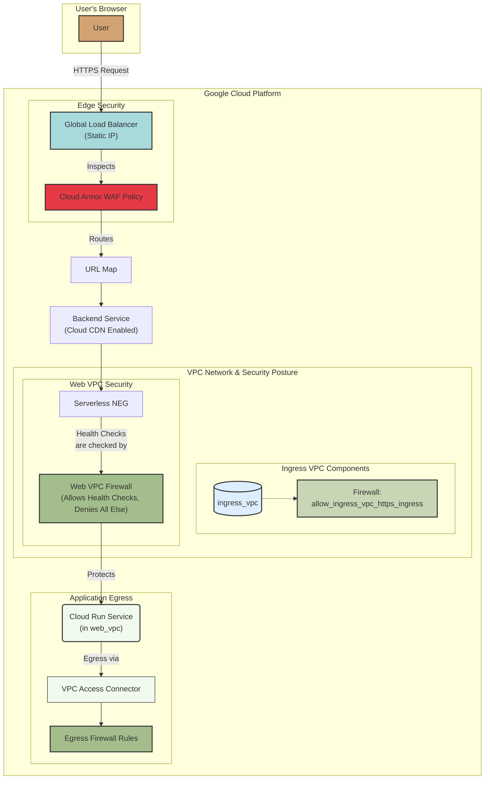

# Google Cloud Platform (GCP) Infrastructure

This document outlines the GCP infrastructure managed by OpenTofu. The infrastructure is divided into two main components: Project Singleton resources and Environment-Specific resources.

## Architecture Diagram

The following diagram illustrates the high-level architecture of the environment-specific deployment, showing the flow of traffic from a user to the backend application.

## Table of Contents
- [Project Singleton Resources](#project-singleton-resources)
- [Environment-Specific Resources](#environment-specific-resources)
  - [Networking](#networking)
  - [Application (Demo Web App)](#application-demo-web-app)
  - [Traffic Management and Security](#traffic-management-and-security)

---

## Project Singleton Resources

These resources are foundational, project-wide components that are created once and are not tied to a specific environment. They are defined in `deploy/opentofu/gcp/project-singleton/`.

| File | Resource | Description |
|---|---|---|
| `apis.tf` | `google_project_service` | Enables essential GCP APIs required for the project, such as Compute Engine (`compute.googleapis.com`), Cloud Run (`run.googleapis.com`), and Billing (`billingbudgets.googleapis.com`). |
| `billing.tf` | `google_billing_budget` | (Conditional) Creates a project-level billing budget to monitor costs in HKD. It is configured to send alerts at 50%, 80%, and 100% of the budget amount. |
| `project_logs_bucket.tf` | `google_logging_project_bucket_config` | (Conditional) Provisions a centralized logging bucket for the project with a 30-day retention period, intended to meet compliance and observability requirements. |

---

## Environment-Specific Resources

These resources define a complete, isolated environment for the application. The deployment of these components is highly modular and controlled by feature flags (e.g., `enable_*` variables). They are defined in `deploy/opentofu/gcp/environment-specific/`.

The entire environment-specific deployment depends on the `project-singleton` layer, referencing it via a `terraform_remote_state` data source.

### Networking

A secure, two-tiered VPC network is established to isolate the application and control traffic flow.

| File | Resource | Description |
|---|---|---|
| `vpcs.tf` | `google_compute_network` | Creates two VPCs: an `ingress_vpc` for external-facing components and a more restricted `web_vpc` for the core application. |
| `subnets.tf` | `google_compute_subnetwork` | Defines subnets within the VPCs, including a dedicated `vpc_connector_subnet` used to bridge the serverless environment with the `web_vpc`. |
| `firewall.tf` | `google_compute_firewall` | Implements a defense-in-depth security model. Rules are set up to allow necessary ingress traffic (e.g., HTTPS, Google health checks) to the appropriate VPCs while denying all other ingress to the secure `web_vpc`. |
| `vpc_connector.tf`| `data.remote_state.singleton.google_vpc_access_connector` | References a Serverless VPC Access connector, which links the Cloud Run service to the `web_vpc`. This allows the serverless application to communicate with resources within the private network and routes all its egress traffic through the VPC. |

### Application (Demo Web App)

A sample web application is deployed using Google's serverless platform, Cloud Run.

| File | Resource | Description |
|---|---|---|
| `cloud_run.tf` | `google_cloud_run_v2_service` | Deploys the containerized demo web application. It is configured to scale to zero for cost-effectiveness and only allow internal traffic from the Load Balancer and the VPC. |
| `cloud_run.tf` | `google_cloud_run_v2_service_iam_member` | Sets an IAM policy to allow public invocation (`allUsers`) of the Cloud Run service, with access control being handled by the load balancer and WAF. |

### Traffic Management and Security

A global load balancer, CDN, and Web Application Firewall (WAF) are used to securely deliver the application to users.

| File | Resource | Description |
|---|---|---|
| `dr_loadbalancers.tf` | `google_compute_global_address` | Reserves a static, global IP address for the load balancer. |
| `dr_loadbalancers.tf` | `google_compute_global_forwarding_rule` | The entry point for all user traffic. It directs incoming HTTPS requests from the global IP address to the target proxy. HTTP traffic is not permitted. |
| `dr_loadbalancers.tf` | `google_compute_target_https_proxy` | Terminates TLS using a self-signed certificate and uses a URL map to route requests. |
| `dr_loadbalancers.tf` | `google_compute_url_map` | Routes incoming requests to the appropriate backend service based on host and path rules. By default, it sends all traffic to the demo web app's backend service. |
| `backend_service.tf`| `google_compute_backend_service` | Defines how the load balancer distributes traffic to the backends. It is configured to log 100% of requests and has Cloud CDN enabled. It is also attached to the WAF policy. |
| `serverless_neg.tf` | `google_compute_region_network_endpoint_group` | A Serverless Network Endpoint Group (NEG) that acts as the bridge between the load balancer's backend service and the serverless Cloud Run application. |
| `waf_policy.tf` | `google_compute_security_policy` | A Cloud Armor (WAF) policy attached to the backend service. It uses preconfigured rules to protect the application from common web attacks like SQL Injection (SQLi) and Cross-Site Scripting (XSS). |
| `cdn_backend.tf` | `google_compute_backend_bucket` | (Conditional) Creates a backend bucket for Cloud CDN to cache and serve static assets. |
