# Security Documentation

This document details the security posture, threat modeling workflows, and manual analysis guides for Vibetics CloudEdge.

## Key Security Controls

**Defense-in-Depth Strategy**: This architecture implements multiple security layers to protect against various attack vectors.

| Layer | Component | Security Feature | Purpose |
|-------|-----------|------------------|---------|
| **Edge** | Cloud Armor (WAF) | Rate limiting, DDoS protection, OWASP rules | Blocks malicious traffic before it reaches infrastructure |
| **Ingress VPC** | Firewall Source Restriction | Restricts HTTPS traffic to configurable source ranges (default: Google Cloud Load Balancer IPs `35.191.0.0/16`, `130.211.0.0/22`) | **Defense-in-depth**: Even if WAF is bypassed, only allowed IPs can reach the ingress layer. Configure via `allowed_https_source_ranges` variable in firewall module. Use `["0.0.0.0/0"]` for testing only. |
| **Load Balancer** | SSL Certificate | TLS 1.2+ encryption | Encrypts data in transit |
| **Load Balancer** | URL Map | Domain-based routing via Host header | Routes traffic to correct backend based on hostname |
| **Backend** | Serverless NEG | Serverless network endpoint | Connects load balancer to Cloud Run without public exposure |
| **Backend** | Cloud Run Ingress | `INGRESS_TRAFFIC_INTERNAL_LOAD_BALANCER` | **Blocks direct public access**, allows only load balancer traffic |
| **Backend** | IAM Policy | `roles/run.invoker` for `allUsers` | **INTENTIONAL for load balancer forwarding**: Cloud Run requires IAM authentication, but Google Cloud Load Balancers cannot provide service account credentials when forwarding traffic. The `allUsers` binding allows the LB to invoke the service. Security is enforced at network layer (WAF, firewall, ingress policy) NOT at Cloud Run IAM layer. |
| **Backend** | Serverless NEG | Google-managed networking | Direct Load Balancer → Cloud Run connectivity via Google's private network (no VPC Connector needed for serverless backends) |

### Threat Modeling

This project requires threat modeling as part of the security development lifecycle, as mandated by the [constitution](.specify/memory/constitution.md) (§7). Threat models help identify security risks, attack vectors, and mitigation strategies before deployment.

#### Threat Modeling Directory Structure

```
threat_modelling/
├── threat-model.yaml           # Threagile threat model definition (version-controlled)
├── threat-model.example.yaml   # Example template with GCP infrastructure
├── reports/                    # Auto-generated reports (CI pipeline, NOT version-controlled)
│   ├── risks.json              # Machine-readable risk findings (Threagile output)
│   ├── risks.xlsx              # Excel report for human review
│   ├── report.pdf              # Comprehensive PDF report
│   ├── data-flow-diagram.png   # Architecture visualization
│   └── data-asset-diagram.png  # Data flow visualization
└── manual/                     # Feature-specific manual threat modeling (optional)
    └── [feature-branch-name]/
        ├── STRIDE-analysis.md
        ├── attack-trees.md
        └── data-flow-diagrams/
```

#### Automated Threat Modeling with Threagile

This project uses **[Threagile](https://threagile.io/)** - an open-source, YAML-based threat modeling toolkit that automatically generates threat reports and diagrams.

- **License**: MIT (free, no login required)
- **Runs**: Docker container (local) or CI pipeline (automated)
- **Outputs**: JSON reports, Excel summaries, PDF reports, PNG diagrams

##### Development Workflow

1. **Developer updates architecture** (e.g., add new module, change networking)
2. **Developer updates `threat-model.yaml`** (describe system architecture changes)
3. **Pre-commit hook validates YAML syntax** (fast, no report generation)
4. **Developer commits and pushes** to feature branch
5. **CI pipeline runs Threagile** (generates reports, diagrams, JSON outputs)
6. **Reports uploaded as GitHub artifacts** (reviewable, auditable)
7. **CI fails if CRITICAL threats detected** (forces remediation or waiver)

---

##### Creating Your Threat Model

**First-time setup** (copy template):

```bash
# Copy example template
cp threat_modelling/threat-model.example.yaml threat_modelling/threat-model.yaml

# Customize threat-model.yaml to describe your architecture:
#   - Technical assets (load balancers, VPCs, Cloud Run, etc.)
#   - Data assets (API requests, logs, state files, secrets)
#   - Communication links (protocols, encryption, authentication)
#   - Trust boundaries (internet → GCP, VPC → Cloud Run, etc.)
#   - Security requirements (CIA triad, compliance controls)
```

**Example architecture to model** (see `threat-model.example.yaml`):

- External clients → Global Load Balancer → Cloud Armor WAF → Cloud Run Backend
- Ingress VPC, Egress VPC, VPC peering
- Data flows: API requests, service logs, OpenTofu state files
- Trust boundaries: Internet → GCP edge, GCP internal networks

**When to update the threat model**:

- ✅ Adding new modules (WAF, CDN, VPC, etc.)
- ✅ Changing network architecture (VPC peering, firewall rules)
- ✅ Modifying data flows (new APIs, external integrations)
- ✅ Altering security controls (encryption, authentication)
- ❌ Minor variable changes or cosmetic updates

---

##### Pre-Commit Validation (Local)

Pre-commit hook validates threat model syntax but **does NOT generate reports** (avoiding file modification during commit):

```bash
# Install pre-commit hooks (if not already installed)
pre-commit install

# Validate threat model manually
pre-commit run check-threat-modeling --all-files
```

**Expected output** (when threat-model.YAML exists and is valid):

```
✓ Threagile threat model YAML syntax valid
```

**Expected warnings** (if infrastructure changed without updating threat model):

```
⚠ WARNING Infrastructure modified but threat model not updated
  → Infrastructure files (.tf/.go) changed
  → Threat model threat_modelling/threat-model.yaml not staged

  Action: Review threat model and update if architecture changed
```

**What pre-commit validates**:

- ✅ `threat-model.yaml` file exists
- ✅ YAML syntax is valid (via `yamllint`)
- ⚠️ Warns if infrastructure files modified but threat model unchanged
- 💡 Suggests creating feature-specific manual threat models for new modules

**What pre-commit does NOT do**:

- ❌ Generate reports (CI pipeline handles this)
- ❌ Run Threagile analysis (CI pipeline handles this)
- ❌ Create or modify files (validation only, fast execution ~0.06s)

---

##### CI Pipeline (Automated Report Generation)

**CI Job**: `ci-threat-model` (defined in `.github/workflows/ci.yml`)

**Trigger**: Every push to feature branches and pull requests

**Script**: `./scripts/generate-threat-model.sh`

**Execution**:

```bash
# CI automatically runs:
./scripts/generate-threat-model.sh  # CI mode (fails on CRITICAL threats)

# CI job steps:
# 1. Pull threagile/threagile:latest Docker image
# 2. Run Threagile analysis on threat-model.yaml
# 3. Generate reports (JSON, Excel, PDF, PNG diagrams)
# 4. Analyze risk severity counts (CRITICAL, HIGH, MEDIUM, LOW)
# 5. Upload reports as GitHub artifacts
# 6. Fail build if CRITICAL threats detected (exit code 1)
```

**Outputs** (uploaded as `threat-model-reports.zip` artifact):

| File | Format | Purpose |
|------|--------|---------|
| `risks.json` | JSON | Machine-readable findings (for tooling integration) |
| `risks.xlsx` | Excel | Human-readable report with severity breakdown |
| `report.pdf` | PDF | Comprehensive threat model documentation |
| `data-flow-diagram.png` | PNG | Architecture visualization with trust boundaries |
| `data-asset-diagram.png` | PNG | Data flow visualization with CIA ratings |

**CI Console Output** (example):

```
═══════════════════════════════════════════════════════════════
  Threat Modeling Results Summary
═══════════════════════════════════════════════════════════════
  CRITICAL: 0
  HIGH:     2
  MEDIUM:   5
  LOW:      8
═══════════════════════════════════════════════════════════════

✓ Threat modeling report generation complete
ℹ Reports available at: threat_modelling/reports/
```

**Viewing CI-generated reports**:

1. **Download GitHub Actions artifacts**:
   - Navigate to: **Actions** → **Your Workflow Run** → **Artifacts** → **threat-model-reports.zip**
   - Extract the ZIP file locally
   - Or use GitHub CLI: `gh run download [run-id] -n threat-model-reports`

2. **Review reports locally**:

   ```bash
   # View risk summary (JSON)
   cat threat_modelling/reports/risks.json | jq '.risks[] | {severity, title, description}'

   # Filter CRITICAL/HIGH risks
   cat threat_modelling/reports/risks.json | jq '.risks[] | select(.severity == "critical" or .severity == "high")'

   # Open Excel report
   open threat_modelling/reports/risks.xlsx

   # View architecture diagrams
   open threat_modelling/reports/data-flow-diagram.png
   open threat_modelling/reports/data-asset-diagram.png
   ```

3. **Check auto-created GitHub Issues** (for CRITICAL/HIGH severity):
   - **Labels**: `security`, `threat-model`, `severity:critical`, `severity:high`
   - **Navigate**: Repository → Issues → Filter by `label:threat-model`
   - **Issue content**: Risk description, mitigation advice, affected assets

**What Threagile analyzes**:

- ✅ Architecture security patterns (trust boundaries, encryption, authentication)
- ✅ Communication link security (TLS versions, VPN usage, IP filtering)
- ✅ Data asset protection (confidentiality, integrity, availability ratings)
- ✅ Attack surface analysis (internet-facing assets, exposed services)
- ✅ STRIDE threat categories (Spoofing, Tampering, Repudiation, Information Disclosure, DoS, Elevation of Privilege)
- ✅ Compliance alignment (security best practices, CIS benchmarks)

**Severity levels** (from constitution §7):

| Severity | Blocks CI | Blocks Deployment | Action Required |
|----------|-----------|-------------------|-----------------|
| **CRITICAL** | ✅ Yes | ✅ Yes | Must fix before merge OR provide approved waiver |
| **HIGH** | ❌ No | ✅ Yes | Must fix before deployment OR time-boxed waiver |
| **MEDIUM** | ❌ No | ❌ No | Must acknowledge and plan remediation |
| **LOW** | ❌ No | ❌ No | Optional, recommended to address |

**Waiver process** (for CRITICAL/HIGH findings):

1. Document risk assessment in PR description
2. Provide mitigation plan or compensating controls
3. Get approval from security lead or tech lead
4. Attach time-boxed waiver (e.g., "Accept risk until 2025-12-01, remediate in JIRA-1234")
5. Add waiver to `threat_modelling/waivers/[risk-id].md` (for audit trail)

---

##### Running Threat Modeling Locally

For local testing and development, you can generate threat model reports on your machine without waiting for CI.

**Prerequisites**:

- Go 1.20+ installed ([install guide](https://go.dev/doc/install))
- `threat_modelling/threat-model.yaml` exists (production-ready threat model provided)

**One-Time Setup** (Build Required Plugin):

```bash
# Install Threagile from source
go install github.com/threagile/threagile@latest

# Build the raa.so plugin (Risk Assessment Algorithm)
# This plugin is required by Threagile but not included in releases
cd ~/.gvm/pkgsets/go*/global/pkg/mod/github.com/threagile/threagile@v*/
go build -buildmode=plugin -o $OLDPWD/threat_modelling/raa.so raa/raa/raa.go
cd -

# Verify plugin was built
ls -lh threat_modelling/raa.so
# Expected: -rwxrwxrwx 1 user user 6.4M ... raa.so
```

**Generate Threat Model Reports**:

```bash
cd threat_modelling

# Generate JSON reports (recommended - diagrams require additional dependencies)
threagile -model threat-model.yaml -output reports \
  -generate-data-flow-diagram=false \
  -generate-data-asset-diagram=false \
  -generate-report-pdf=false \
  -generate-risks-excel=false \
  -generate-tags-excel=false

# View generated reports
ls -lh reports/
# Expected output:
#   risks.json               - Risk findings with severity levels
#   stats.json               - Statistics summary
#   technical-assets.json    - Asset inventory
```

**Analyze Results**:

```bash
# View risk summary by severity and status
jq '{total_risks: (. | length), by_severity: (group_by(.severity) | map({severity: .[0].severity, count: length})), by_status: (group_by(.risk_status) | map({status: .[0].risk_status, count: length}))}' reports/risks.json

# Example output:
# {
#   "total_risks": 15,
#   "by_severity": [
#     {"severity": "elevated", "count": 2},
#     {"severity": "medium", "count": 9},
#     {"severity": "low", "count": 4}
#   ],
#   "by_status": [
#     {"status": "false-positive", "count": 2},
#     {"status": "unchecked", "count": 13}
#   ]
# }

# View specific severity risks with details
jq '.[] | select(.severity == "elevated") | {title, risk_status, synthetic_id}' reports/risks.json

# List all unchecked risks
jq '.[] | select(.risk_status == "unchecked") | {severity, title, synthetic_id}' reports/risks.json
```

**Working with Threat Findings (Risk Tracking)**:

When Threagile identifies threats, you need to triage and document each finding. This is done via the `risk_tracking` section in `threat-model.yaml`.

**Step 1: Identify the Risk**

```bash
# List all risks that need triage (unchecked status)
cd threat_modelling
jq '.[] | select(.risk_status == "unchecked") | {severity, title, synthetic_id}' reports/risks.json

# Example output:
# {
#   "severity": "elevated",
#   "title": "<b>Unguarded Access from Internet</b>...",
#   "synthetic_id": "unguarded-access-from-internet@cloud-run-backend@global-https-lb@global-https-lb>lb-to-cloud-run"
# }
```

**Step 2: Copy the `synthetic_id`** (this is the risk ID you'll use in risk_tracking)

**Step 3: Add Risk Tracking Entry to threat-model.yaml**

Edit `threat_modelling/threat-model.yaml` and add to the `risk_tracking:` section at the end of the file:

```yaml
risk_tracking:

  # Example 1: Mark as FALSE POSITIVE (risk doesn't apply to this architecture)
  unguarded-access-from-internet@cloud-run-backend@global-https-lb@global-https-lb>lb-to-cloud-run:
    status: false-positive
    justification: >
      This is edge infrastructure providing networking layer only. Application teams
      deploy their own API Gateways (Cloud Endpoints, Apigee, Kong) inside Cloud Run
      containers. Authentication happens at the application layer, not infrastructure layer.

      Defense-in-Depth Layers:
      1. Infrastructure (this project): Global HTTPS LB + Cloud Armor WAF
      2. Application (app teams): API Gateway with OAuth 2.0/JWT/API keys

      Threagile correctly identifies no auth at infrastructure layer, but this is
      intentional - authentication is responsibility of application workloads.
    ticket: INFRA-001
    date: 2025-10-18
    checked_by: DevSecOps Team

  # Example 2: Mark as ACCEPTED (risk acknowledged, won't fix)
  missing-build-pipeline@cloud-run-backend:
    status: accepted
    justification: >
      Demo backend is for infrastructure testing only, not production application.
      Production applications MUST implement proper CI/CD pipelines with SAST, SCA,
      container scanning, and automated deployment. Build pipeline security is
      responsibility of application teams, not edge infrastructure.
    ticket: INFRA-003
    date: 2025-10-18
    checked_by: DevSecOps Team

  # Example 3: Mark as MITIGATED (risk has been fixed)
  missing-waf@global-https-lb:
    status: mitigated
    justification: >
      Cloud Armor WAF has been deployed with OWASP Top 10 rules, rate limiting,
      adaptive DDoS protection, and geo-blocking capabilities. See main.tf lines 250-320.
    ticket: INFRA-004
    date: 2025-10-18
    checked_by: DevSecOps Team

  # Example 4: Mark as IN-DISCUSSION (team is evaluating)
  missing-network-segmentation@egress-vpc:
    status: in-discussion
    justification: >
      Evaluating whether egress VPC should be further segmented by application tier.
      Pending architecture review meeting on 2025-10-25.
    ticket: INFRA-005
    date: 2025-10-18
    checked_by: Security Lead
```

**Step 4: Regenerate Reports to Verify**

```bash
# Regenerate threat model
threagile -model threat-model.yaml -output reports \
  -generate-data-flow-diagram=false \
  -generate-data-asset-diagram=false \
  -generate-report-pdf=false \
  -generate-risks-excel=false \
  -generate-tags-excel=false

# Verify risk status changed from "unchecked" to your chosen status
jq '.[] | select(.synthetic_id == "unguarded-access-from-internet@cloud-run-backend@global-https-lb@global-https-lb>lb-to-cloud-run") | {title, risk_status}' reports/risks.json

# Expected output:
# {
#   "title": "<b>Unguarded Access from Internet</b>...",
#   "risk_status": "false-positive"
# }
```

**Risk Status Options**:

| Status | When to Use | CI/CD Behavior |
|--------|-------------|----------------|
| `false-positive` | Risk doesn't apply to this architecture/design | Pass (risk ignored) |
| `mitigated` | Risk has been fixed/addressed | Pass (risk resolved) |
| `accepted` | Risk acknowledged, decision made not to fix | Pass (documented acceptance) |
| `in-discussion` | Team is evaluating the risk | Warn (needs decision) |
| `unchecked` | Risk not yet triaged (default) | Fail (requires action) |

**Making Threagile Pass in CI/CD**:

For CI/CD to pass, all risks with severity >= threshold must be tracked:

```yaml
# In .github/workflows/threat-model.yaml or similar
- name: Check for untracked risks
  run: |
    cd threat_modelling
    UNTRACKED=$(jq '[.[] | select(.risk_status == "unchecked" and (.severity == "critical" or .severity == "elevated"))] | length' reports/risks.json)
    if [ "$UNTRACKED" -gt 0 ]; then
      echo "ERROR: $UNTRACKED critical/elevated risks are not tracked in risk_tracking section"
      jq '.[] | select(.risk_status == "unchecked" and (.severity == "critical" or .severity == "elevated")) | {severity, title, synthetic_id}' reports/risks.json
      exit 1
    fi
```

**Best Practices**:

1. **Use `synthetic_id` exactly as generated** - Threagile is strict about ID format
2. **Document justifications thoroughly** - Include WHY the decision was made
3. **Reference tickets** - Link to GitHub issues, JIRA tickets, or ADRs
4. **Get approval** - Have security lead or PO review and check-by
5. **Triage promptly** - Don't leave risks in `unchecked` status
6. **Re-evaluate periodically** - Accepted risks may need revisiting as architecture evolves

**Common Pitfalls**:

```bash
# WRONG: Using abbreviated risk ID
xxe@global-https-lb:  # ❌ Will fail with "risk id not found"

# CORRECT: Using full synthetic_id from risks.json
xml-external-entity@global-https-lb:  # ✅ Matches generated ID

# WRONG: Typo in status
status: accept  # ❌ Invalid status

# CORRECT: Use exact status values
status: accepted  # ✅ Valid status
```

**Why Diagrams/Excel Are Disabled**:

- **Diagrams**: Require `render-data-flow-diagram.sh` script (missing from standard Threagile installation)
- **Excel**: Sheet name length limitations with long technical asset names
- **Recommendation**: Use JSON output for local development, CI pipeline handles full reports

**Alternative: Use Docker** (if raa.so plugin issues):

The production threat model (`threat-model.yaml`) is ready to use with CI/CD pipelines which use the official Docker image. For local development, the Go-based approach above is recommended.

**Expected output** (when threat-model.yaml exists):

```text
ℹ Starting Threagile threat modeling report generation...
ℹ Mode: LOCAL

ℹ Validating prerequisites...
✓ Docker found: Docker version 28.4.0, build d8eb465
✓ Threat model found: threat_modelling/threat-model.yaml
✓ Reports directory ready: threat_modelling/reports

ℹ Pulling Threagile Docker image...
✓ Threagile image pulled successfully

ℹ Generating threat model reports with Threagile...
✓ Threagile analysis completed

ℹ Analyzing threat modeling results...
═══════════════════════════════════════════════════════════════
  Threat Modeling Results Summary
═══════════════════════════════════════════════════════════════
  CRITICAL: 0
  HIGH:     2
  MEDIUM:   5
  LOW:      8
═══════════════════════════════════════════════════════════════

✓ Threat modeling report generation complete
ℹ Reports available at: threat_modelling/reports/

ℹ View reports:
ℹ   JSON:   cat threat_modelling/reports/risks.json | jq
ℹ   Excel:  open threat_modelling/reports/risks.xlsx
ℹ   Images: open threat_modelling/reports/*.png
```

**If threat-model.yaml doesn't exist**:

```text
ℹ Starting Threagile threat modeling report generation...
ℹ Mode: LOCAL

ℹ Validating prerequisites...
✓ Docker found: Docker version 28.4.0, build d8eb465
✗ Threat model not found: threat_modelling/threat-model.yaml
✗ Create threat_modelling/threat-model.yaml before running this script

# To fix: Copy the example template
cp threat_modelling/threat-model.example.yaml threat_modelling/threat-model.yaml
```

**Compliance Mappings**:

The production threat model (`threat-model.yaml`) includes comprehensive compliance mappings:

- **OWASP Top 10 2021**: All categories (A01-A10) with mitigation strategies
- **CIS GCP Foundations**: Network security (3.x), IAM policies (7.x)
- **NIST 800-53 Rev 5**: AC (Access Control), AU (Audit), SC (Network Security)
- **SOC 2 Type II**: Trust Service Criteria (CC6.1, CC6.2, CC6.6, CC7.2)

**Current Risk Profile** (from production threat-model.yaml):

- **Total Risks**: 15
- **Severity Breakdown**: 2 elevated (both false-positive), 9 medium, 4 low
- **Risk Status**: 2 false-positive, 13 unchecked (require triage)
- **No CRITICAL risks detected**

The 2 elevated risks are marked as false-positive:

1. **Unguarded Access from Internet**: Edge infrastructure design - application teams deploy API Gateways in Cloud Run
2. **XML External Entity (XXE)**: JSON-only APIs - no XML parsing at any layer

**Pre-Commit Hook Integration**:

The threat modeling validation runs automatically on every commit via pre-commit hooks:

```bash
# Automatic validation on every commit (fast - uses existing reports)
git commit -m "feat: add new module"
# Output:
# Threagile Threat Model Validation........................................Passed
# ✓ Threat model YAML syntax valid
# ℹ Using existing threat reports (threat-model.yaml unchanged)
# ✓ All critical/elevated risks tracked (2/15 risks addressed)

# Force full report generation on commit (slow - regenerates reports)
THREAGILE_FULL_REPORT=1 git commit -m "feat: update threat model"
# Output:
# ℹ THREAGILE_FULL_REPORT=1 - Generating full threat analysis...
# ✓ Threat model reports generated successfully
# ✓ All critical/elevated risks tracked (2/15 risks addressed)

# Run threat model check manually without committing
pre-commit run check-threat-modeling --all-files

# Run with full report generation
THREAGILE_FULL_REPORT=1 pre-commit run check-threat-modeling --all-files
```

**Pre-Commit Behavior**:

| Scenario | Action Taken | Speed | Exit Code |
|----------|-------------|-------|-----------|
| threat-model.yaml unchanged + reports exist | Validate existing reports only | ~1s | 0 if no untracked critical/elevated |
| threat-model.yaml modified | Regenerate reports + validate | ~10-30s | 0 if no untracked critical/elevated |
| No reports exist | Generate initial reports + validate | ~10-30s | 0 if no untracked critical/elevated |
| THREAGILE_FULL_REPORT=1 | Force full regeneration + validate | ~10-30s | 0 if no untracked critical/elevated |
| Critical/elevated risks unchecked | List untracked risks + FAIL | N/A | 1 (blocks commit) |
| Threagile not installed | Skip validation (warn only) | ~1s | 0 (allows commit) |

**What Gets Checked**:

1. **YAML Syntax**: Validates threat-model.yaml is well-formed
2. **Report Generation**: Automatically regenerates if threat-model.yaml changed
3. **Untracked Risks**: BLOCKS commit if any CRITICAL or ELEVATED risks are `unchecked`
4. **Infrastructure Changes**: Warns if .tf/.go files changed but threat model wasn't updated

**Example: Pre-Commit Blocking Untracked Risks**:

```bash
# Attempt to commit with untracked critical risks
git commit -m "feat: add new module"

# Output:
# Threagile Threat Model Validation........................................Failed
# - hook id: check-threat-modeling
# - exit code: 1
#
# ✗ FAIL 2 critical/elevated risk(s) require triage in threat-model.yaml
#
#   Untracked Risks:
#   - [ELEVATED] Unguarded Access from Internet of Cloud Run Backend...
#   - [ELEVATED] XML External Entity (XXE) risk at Global HTTPS Load Balancer
#
#   Action Required:
#   1. Review risks: jq '.[] | select(.risk_status == "unchecked")' threat_modelling/reports/risks.json
#   2. Add risk_tracking entries to threat_modelling/threat-model.yaml (see README.md)
#   3. Regenerate: cd threat_modelling && threagile -model threat-model.yaml -output reports ...
#
#   Documentation: README.md (search 'Working with Threat Findings')
#   Quick Reference: threat_modelling/RISK_TRACKING_GUIDE.md
```

#### Manual Threat Modeling (STRIDE Methodology)

For major features or architectural changes, manual threat modeling should be conducted using the STRIDE framework.

**When to perform manual threat modeling**:

- ✅ New infrastructure architecture (e.g., adding DR, multi-region)
- ✅ New security boundaries (e.g., VPC peering, service mesh)
- ✅ External integrations (e.g., API Gateway, third-party services)
- ✅ Data classification changes (e.g., handling PII, financial data)
- ❌ Minor configuration changes to existing resources

**STRIDE Framework**:

| Threat Category | Description | Example Threats |
|----------------|-------------|-----------------|
| **S**poofing | Impersonating something or someone | Service account key theft, IP spoofing |
| **T**ampering | Modifying data or code | Man-in-the-middle attacks, unauthorized config changes |
| **R**epudiation | Claiming to have not performed an action | Missing audit logs, non-traceable actions |
| **I**nformation Disclosure | Exposing information to unauthorized parties | Public S3 buckets, exposed secrets, verbose errors |
| **D**enial of Service | Deny or degrade service availability | DDoS attacks, resource exhaustion |
| **E**levation of Privilege | Gain capabilities without authorization | IAM misconfigurations, container escapes |

**How to create a manual threat model**:

1. **Create a data flow diagram** (DFD):

   ```bash
   # Create directory for your feature
   mkdir -p threat_modelling/manual/feature-name/

   # Document data flows (use draw.io, Mermaid, or ASCII diagrams)
   # Save as: threat_modelling/manual/feature-name/data-flow-diagram.png
   ```

2. **Identify trust boundaries**:
   - External users → Load Balancer
   - Load Balancer → VPC (ingress)
   - VPC → Cloud Run backend
   - Cloud Run → External APIs

3. **Apply STRIDE to each component and boundary**:

   ```bash
   # Create STRIDE analysis document
   cat > threat_modelling/manual/feature-name/STRIDE-analysis.md <<EOF
   # STRIDE Analysis: [Feature Name]

   ## Component: [e.g., Cloud Run Backend]

   ### Spoofing
   - **Threat**: Attacker impersonates legitimate service account
   - **Mitigation**: Use Workload Identity, rotate service account keys every 90 days
   - **Residual Risk**: LOW (compensating controls in place)

   ### Tampering
   - **Threat**: Man-in-the-middle attack on API traffic
   - **Mitigation**: TLS 1.2+ enforced, Cloud Armor blocks non-HTTPS
   - **Residual Risk**: LOW

   [Continue for T, R, I, D, E...]

   ## Trust Boundary: Internet → Cloud Armor WAF

   ### Spoofing
   - **Threat**: DDoS attack from spoofed IP addresses
   - **Mitigation**: Cloud Armor adaptive protection, rate limiting
   - **Residual Risk**: MEDIUM (sophisticated DDoS requires additional mitigation)

   [Continue for all boundaries...]
   EOF
   ```

4. **Document attack trees** (optional, for complex features):

   ```bash
   # Create attack tree diagram
   cat > threat_modelling/manual/feature-name/attack-trees.md <<EOF
   # Attack Trees: [Feature Name]

   ## Attack Goal: Gain unauthorized access to Cloud Run backend

   ```

   [Root] Unauthorized Access to Backend
   ├── [AND] Bypass WAF
   │   ├── Exploit WAF rule gap
   │   └── Use legitimate user agent
   ├── [OR] Compromise Load Balancer
   │   ├── Exploit LB vulnerability (CVSS 7.5+)
   │   └── Steal LB admin credentials
   └── [OR] Direct access to Cloud Run
       ├── Find exposed Cloud Run URL (BLOCKED by ingress policy)
       └── Compromise VPC network (LOW likelihood)

   ```
   EOF
   ```

5. **Review and validate**:
   - Peer review threat model with team
   - Validate mitigations are implemented
   - Update threat model when architecture changes

**Tools for threat modeling** (optional):

- **Microsoft Threat Modeling Tool**: GUI-based STRIDE analysis
  - Download: https://aka.ms/threatmodelingtool

- **OWASP Threat Dragon**: Open-source threat modeling tool
  - Install: `npm install -g owasp-threat-dragon`

- **draw.io / Mermaid**: For data flow diagrams
  - Online: https://app.diagrams.net/
  - Mermaid in Markdown (supported in GitHub)

**Example Mermaid diagram** (paste in Markdown):

```mermaid
graph LR
    A[External User] -->|HTTPS| B[Cloud Armor WAF]
    B -->|Filtered Traffic| C[HTTPS Load Balancer]
    C -->|Internal| D[Serverless NEG]
    D -->|Private Network| E[Cloud Run Backend]
    E -->|API Call| F[External Service]

    style B fill:#f96,stroke:#333,stroke-width:2px
    style C fill:#96f,stroke:#333,stroke-width:2px
    style E fill:#9f6,stroke:#333,stroke-width:2px
```



#### Current Architecture Security Controls

For the baseline infrastructure (Feature 001), see the **[Key Security Controls](#key-security-controls)** section above.

**Threat Model Status**:

- ✅ Automated threat detection via CI pipeline
- ✅ Defense-in-depth architecture (WAF, Firewall, Ingress Policy)
- ⚠️ Manual STRIDE analysis: Recommended for Feature 002 (multi-backend) and Feature 003 (DR)

#### Accessing Historical Threat Reports

Threat reports from past PRs are stored in the repository history:

```bash
# View threat reports from specific commit
git show <commit-sha>:threat_modelling/reports/pr-threats.md

# Search commit history for threat reports
git log --all --full-history -- threat_modelling/reports/

# View all security issues ever created
# Navigate to: GitHub → Issues → Filter: is:issue label:threat-model is:closed
```

**Note**: The `threat_modelling/reports/` directory is currently empty as the CI pipeline implementation is pending. Once CI is configured, reports will be automatically generated on every PR.

## Branching Strategy & Git Workflow

This project follows a strict Git promotion model as defined in the [constitution](.specify/memory/constitution.md) (§1). All changes flow through a controlled promotion pipeline across protected branches.

### Branch Structure

The repository maintains three protected branches representing different stages of the deployment pipeline:

| Branch | Purpose | Deployment Target | Protection |
|--------|---------|------------------|------------|
| **`main`** | Integration branch for approved features | Not deployed (aggregation only) | PR-only, no direct pushes |
| **`nonprod`** | Non-production testing and validation | `nonprod` environment (infrastructure team only) | PR-only, requires main merge + CI pass |
| **`prod`** | Production-ready releases | `prod` environment (application teams + production) | PR-only, requires nonprod validation + approval |

```
